# **Práctica 4.1 - Configuración de un servidor DNS**

El primer paso para esta práctica sera conectar nuestra maquina por ssh.

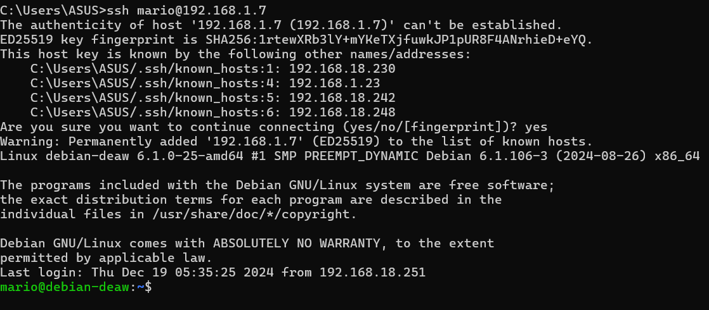

## Instalación de servidor DNS

Primero, instalamos BIND9, el software estándar para servidores DNS en sistemas Unix/Linux.

```bash
sudo apt-get install bind9 bind9utils bind9-doc
```
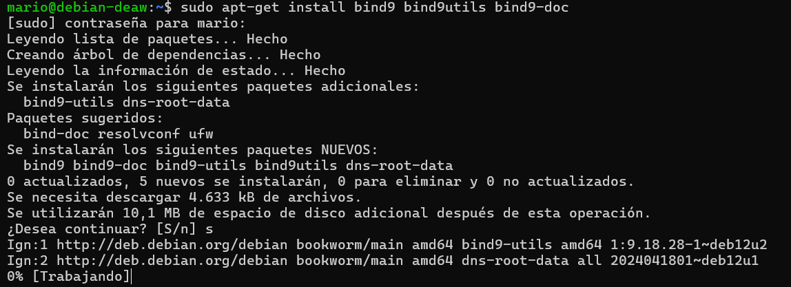

## Configuración del servidor

Como solo vamos a usar ipv4 tendremos que modificar el archivo general de configuración de bind

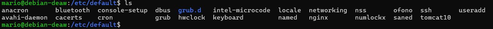

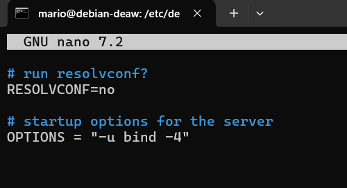

El archivo de configuración principal named.conf de Bind está en el directorio:

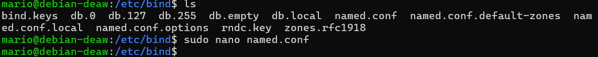

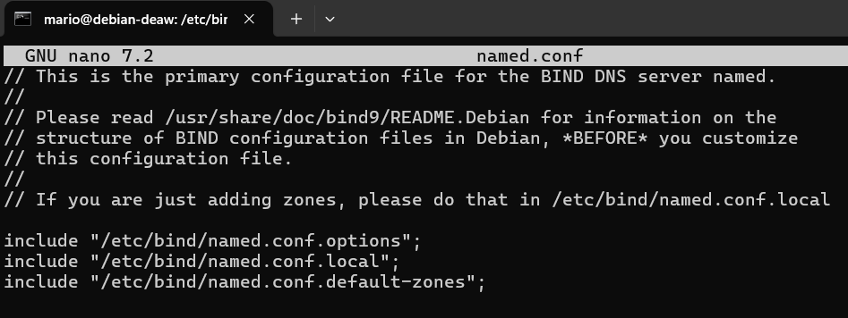

Estos 3 includes hacen referencia a los 3 diferentes archivos donde deberemos realizar la configuración.

### Configuración named.conf.options

Tendremos que crear la copia de seguridad con el siguiente comando

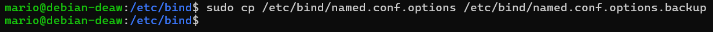

Editamos este archivo para definir opciones globales, como las redes que podrán realizar consultas DNS.

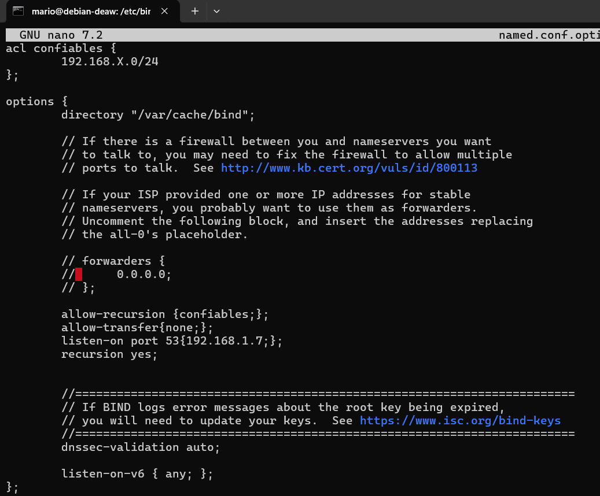

Comprobaremos si nuestra configuración es correcta con los siguientes comandos:


### Configuración named.conf.local

Aquí definimos las zonas para las que nuestro servidor será autoritativo. (en el archivosudo named.conf.local)

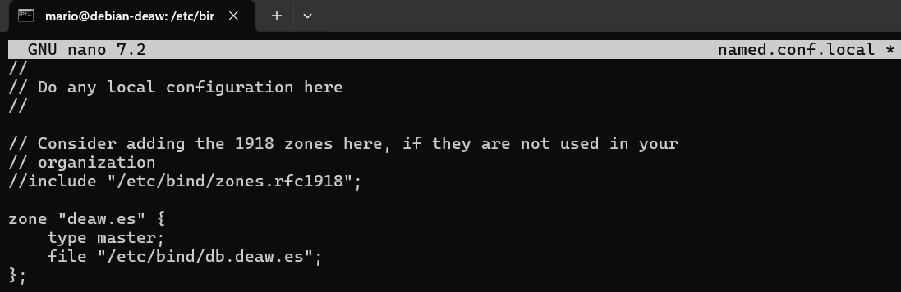

### Creación del archivo de zona

Creamos el archivo para la zona deaw.es.

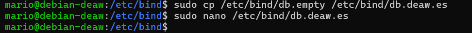

se deberá configurar de la siguiente manera

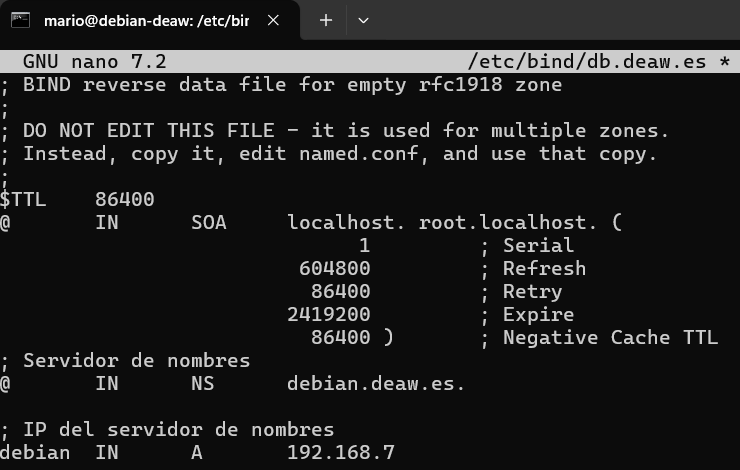

### Creación del archivo de zona para la resolución inversa

En este paso crearemos el archivo para la resolución inversa.

Deberemos añadir lo siguiente en el mismo archivo de configuración

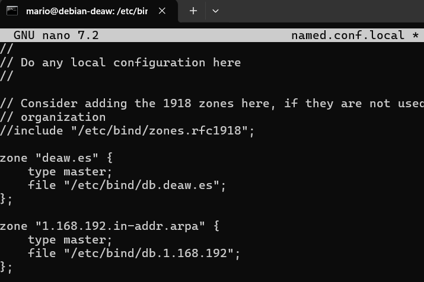

Además se creará el archivo correspondiente con su configuracion:

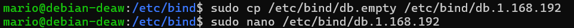

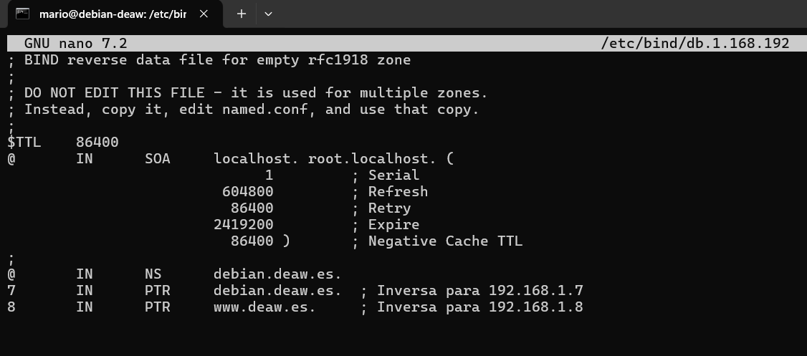

### Comprobación de las configuraciones

Comprobaremos que la zona directa e inversa estan correctas segun estos comandos

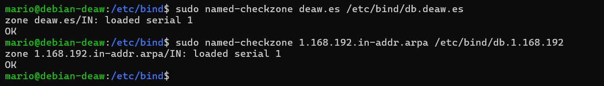

de esta manera significa que está correcto

Reiniciamos el servicio y comprobamos el estado:

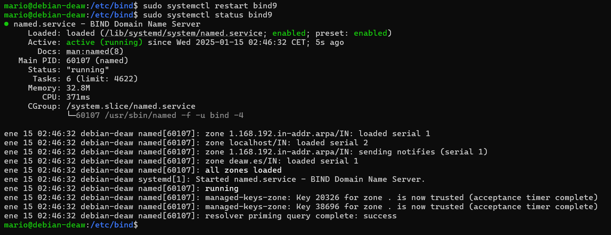

## Comprobación de las resoluciones y de las consultas

Podemos comprobar que todo está correcto desde los clientes, con los comandos dig y nslookup las resoluciones directas e inversas de la siguiente forma.

Es importante que el cliente esté configurado para usarse como servidor DNS para que funcione

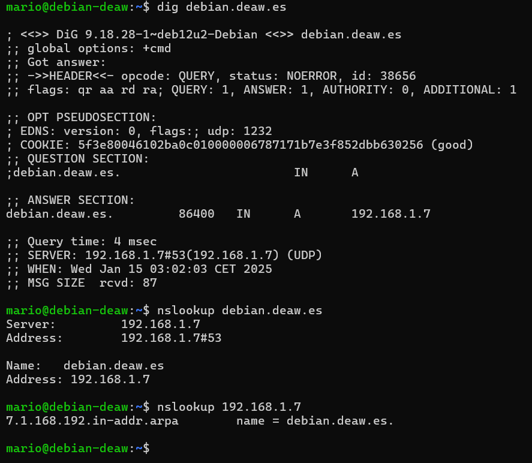

## Cuestiones finales

*Cuestión 1*
Si un cliente de una red diferente intenta hacer uso de tu DNS, no le funcionará a menos que hayas configurado el servidor para permitirlo. En la configuración de BIND, específicamente en la sección acl y allow-recursion, puedes ver si se permiten consultas recursivas solo desde ciertas redes. Por ejemplo, si en named.conf.options tienes una ACL como allow-recursion { 192.168.X.0/24; };, solo los clientes de esa subred podrán hacer consultas recursivas. Si un cliente fuera de esa red intenta realizar una consulta, no podrá resolver nombres a menos que tenga permisos específicos.

*Cuestión 2*
Permitir consultas recursivas en la configuración de un servidor DNS es necesario para que los clientes puedan consultar dominios que no están almacenados localmente en el servidor. Si no se permiten consultas recursivas, el servidor solo podrá resolver dominios para los cuales tiene una zona configurada. Al habilitar la recursión, el servidor DNS puede realizar consultas hacia otros servidores DNS en Internet para resolver nombres que no conoce, haciendo que el cliente reciba una respuesta correcta.

*Cuestión 3*
El servidor DNS que acabamos de montar sí es autoritativo. Esto se debe a que hemos configurado una zona en el archivo de configuración de BIND con la directiva type master, lo que indica que el servidor tiene control completo sobre esa zona y es responsable de responder consultas para ella de manera autoritativa.

*Cuestión 4*
La directiva $ORIGIN se encuentra dentro de los archivos de zona de BIND y se utiliza para especificar el dominio base para los registros de esa zona. Su propósito es simplificar la configuración, ya que permite que los registros de la zona no tengan que especificar el dominio completo en cada entrada. Si $ORIGIN está configurado como deaw.es., entonces cualquier nombre sin un dominio completo será interpretado como nombre.deaw.es..

*Cuestión 5*
No, una zona no es idéntica a un dominio. Un dominio es una parte de la jerarquía del sistema de nombres de dominio (DNS), mientras que una zona es una sección de esa jerarquía que un servidor DNS administra. Una zona puede contener uno o más dominios, pero también puede incluir subzonas, por ejemplo, el dominio deaw.es puede tener una zona de DNS que cubra deaw.es y sus subdominios.

*Cuestión 6*
No, los archivos de zona en un servidor esclavo no deben ser editados directamente. Un servidor DNS esclavo o secundario obtiene sus archivos de zona de un servidor maestro. Los cambios en los archivos de zona deben hacerse en el servidor maestro, y luego el servidor esclavo los recibirá mediante transferencia de zona.

*Cuestión 7*
Tener más de un servidor esclavo para una misma zona proporciona alta disponibilidad y redundancia. Si un servidor esclavo falla, otro servidor esclavo puede tomar su lugar, asegurando que las consultas DNS sigan funcionando correctamente. También mejora el rendimiento, ya que las consultas pueden distribuirse entre varios servidores esclavos.

*Cuestión 8*
En el mundo del DNS, existen 13 servidores raíz principales (denominados A a M), aunque estos están distribuidos y replicados por todo el mundo a través de diferentes servidores para mejorar la disponibilidad. Estos servidores son responsables de dirigir las consultas a los servidores de nombres autoritativos para los dominios de nivel superior (.com, .org, etc.).

*Cuestión 9*
Una consulta iterativa de referencia es cuando un servidor DNS, al no tener la información que se le solicita, devuelve la dirección de otro servidor DNS que podría tener la respuesta. El cliente realiza entonces una nueva consulta a ese servidor. Es decir, el servidor original no responde directamente a la consulta, sino que dirige al cliente a otro servidor.

*Cuestión 10*
En una resolución inversa, la dirección IP 172.16.34.56 se mapearía al nombre de dominio que corresponde en el archivo de zona inversa de la red 172.16.34.0/24. Para hacer esto, se busca en el archivo de zona inversa correspondiente, y si existe un registro PTR para esa dirección IP, se devolvería el nombre asociado. Por ejemplo, si la zona inversa estuviera configurada correctamente, el nombre podría ser algo como 56.34.16.172.in-addr.arpa, que resolvería a un nombre como host1.deaw.es..


