# **ejercicios Git y GitHub**

## Repositorio DEAW

Empezaremos Creando un repositorio en nuestro GitHub llamado DEAW.

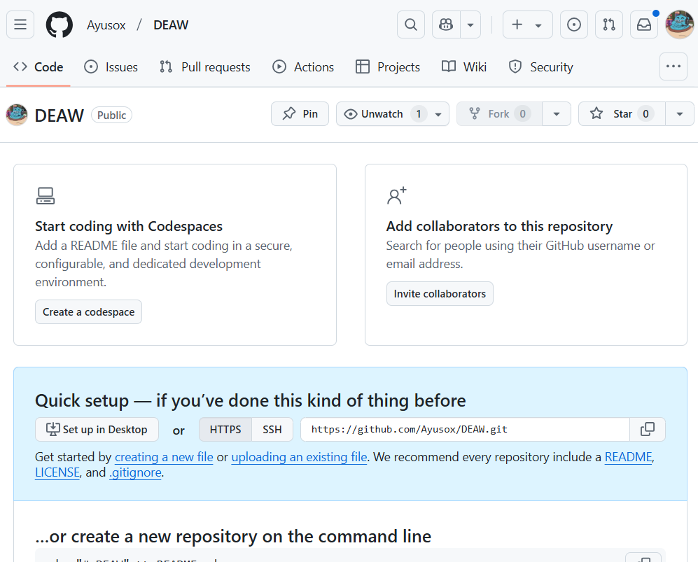

Clonamos el repositorio en local.

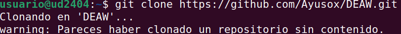

## Readme.md
dentro de nuestro repositorio local crearemos un documento README.md

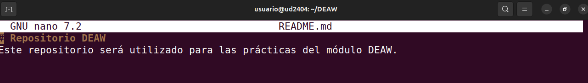

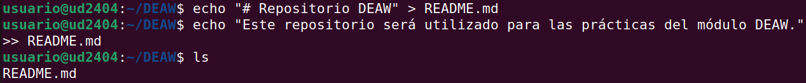

## Commit
haremos el primer commit con el comentario

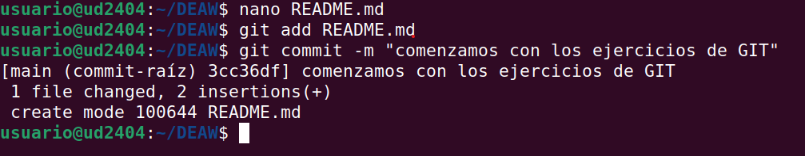

## Push

Subiremos los cambios al repositorio de la siguiente manera

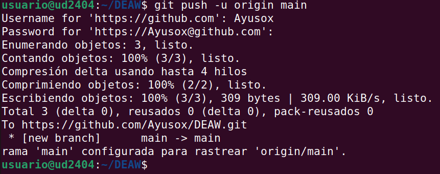

para comprobarlo veremos el .md en el repositorio

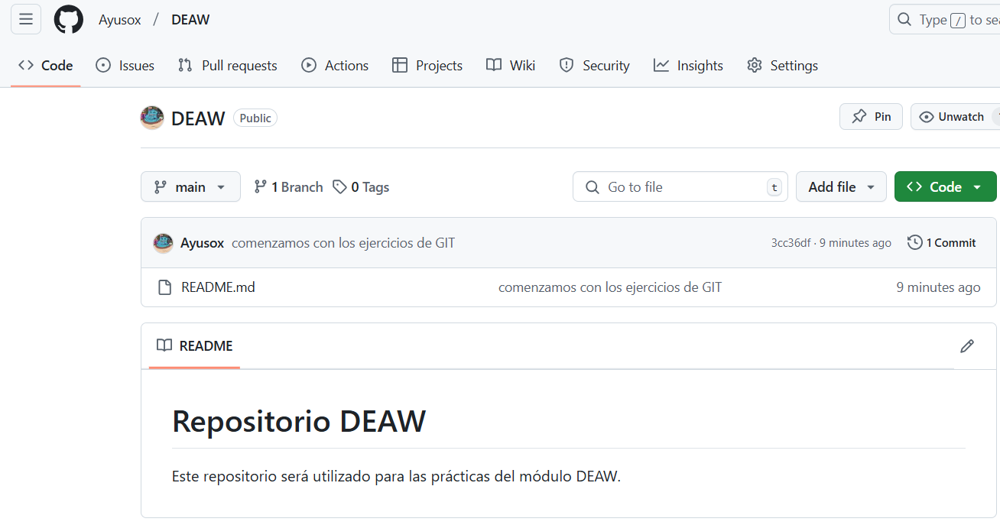

## Ignorar archivos

A veces, hay archivos o carpetas que no queremos incluir en el repositorio, ya sea porque contienen información sensible (contraseñas, claves API), archivos temporales, o simplemente porque no son necesarios en GitHub.

Para ello, usamos un archivo especial llamado .gitignore, que le dice a Git qué archivos y carpetas debe ignorar.

Creamos en el repositorio local un fichero llamado privado.txt.

Creamos en el repositorio local una carpeta llamada privada.

Realizamos los cambios oportunos para que tanto el archivo como la carpeta sean ignorados por git.

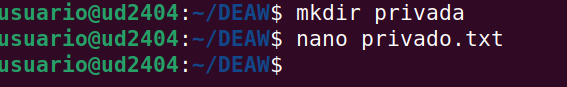

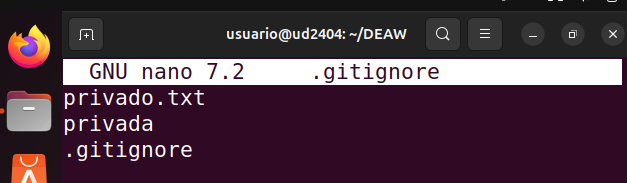

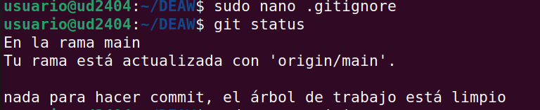

## Añadir fichero 1.txt

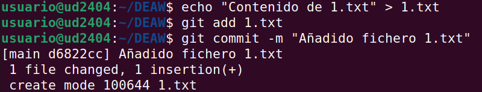

Al hacer esto, se deberá hacer un push, para que lo muestre en el repositorio.

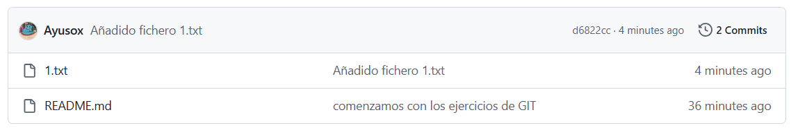

## Crear un tag y subirlo al repositorio remoto

Los tags en Git se usan para marcar versiones importantes del código, como hitos o lanzamientos de software.

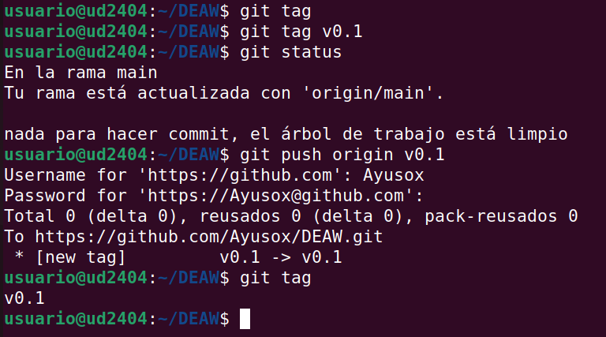

En este caso, hemos creado el tag v0.1 para marcar la primera versión del repositorio.

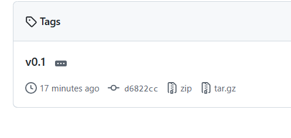

## Cuenta de GitHub

Poner una foto en vuestro perfil de GitHub.

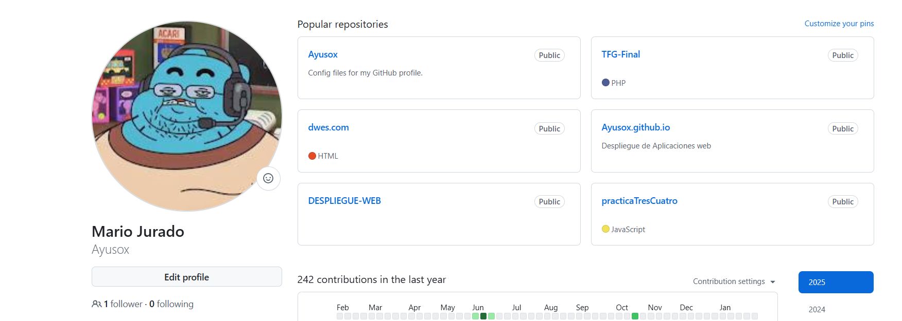

Poner el doble factor de autentificación en vuestra cuenta de GitHub.

La autenticación en dos factores (2FA) mejora la seguridad de tu cuenta, ya que además de tu contraseña, necesitarás un código adicional para iniciar sesión.

📌 Paso 1: Acceder a la configuración de seguridad
1️⃣ Inicia sesión en GitHub: https://github.com/
2️⃣ Ve a la esquina superior derecha y haz clic en tu foto de perfil.
3️⃣ Selecciona "Settings" (Configuración).
4️⃣ En el menú izquierdo, haz clic en "Password and authentication" (Contraseña y autenticación).

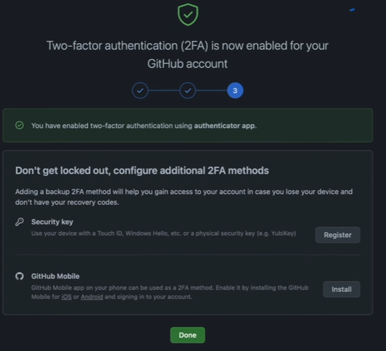

## Uso Social de Github

Preguntar los nombres de usuario de GitHub de 2 de tus compañeros de clase, búscalos, y sigueles.

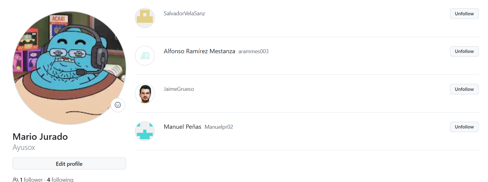

Seguir los repositorios DEAW del resto de tus compañeros.

Añadir una estrella a los repositorios DEAW del resto de tus compañeros.

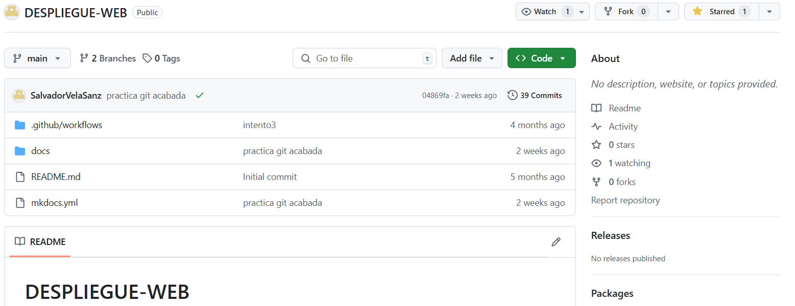

## Crear una tabla

Crear una tabla en el fichero README.md con la información básica de los compañeros de clase.

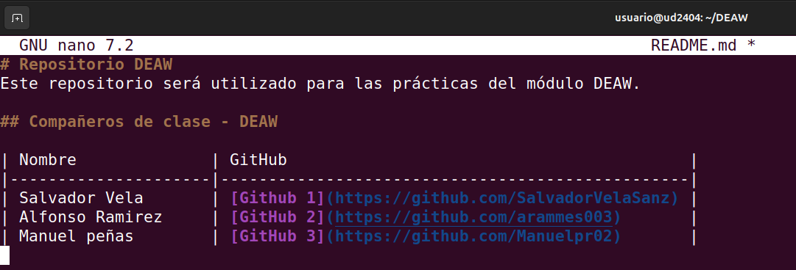

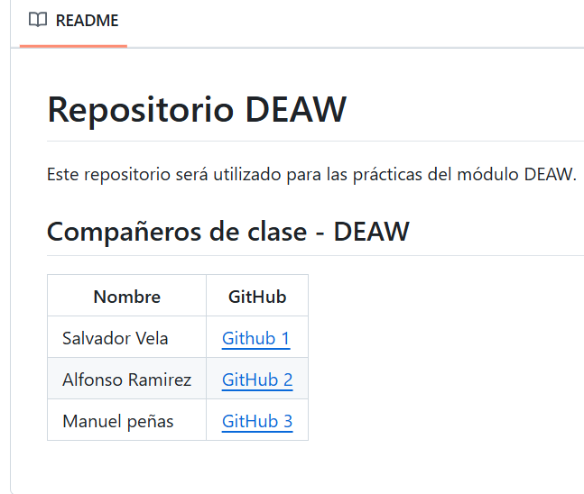

## Colaboradores

Añadiremos a un compañero de clase como colaborador del repositorio DEAW.

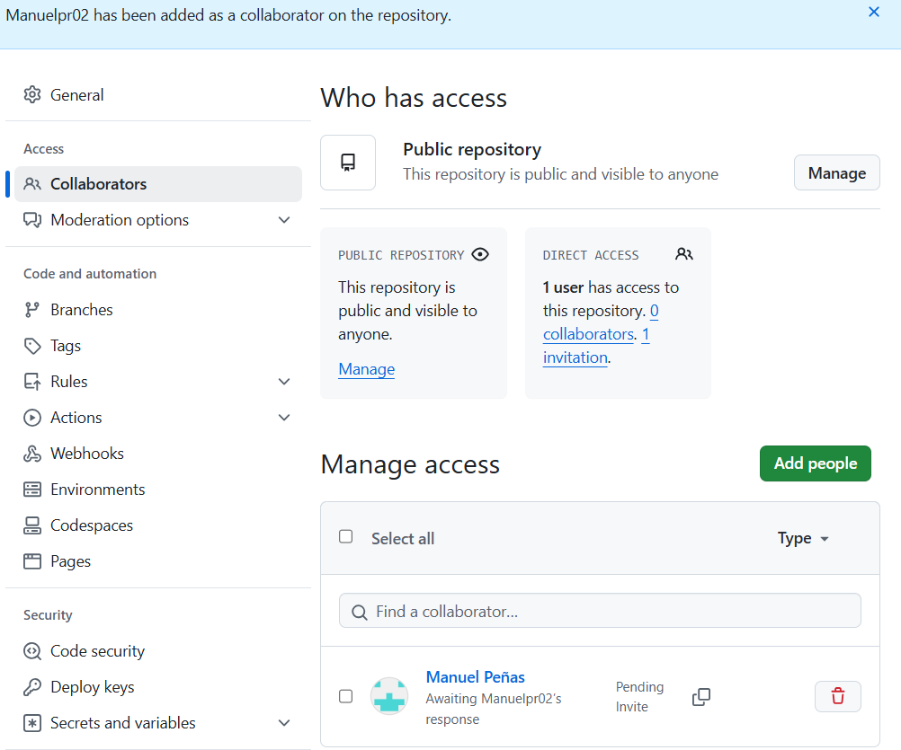

## Crear una rama v0.2 y añadir un fichero 2.txt

Crearemos una rama v0.2 y cambiamos a esa rama.

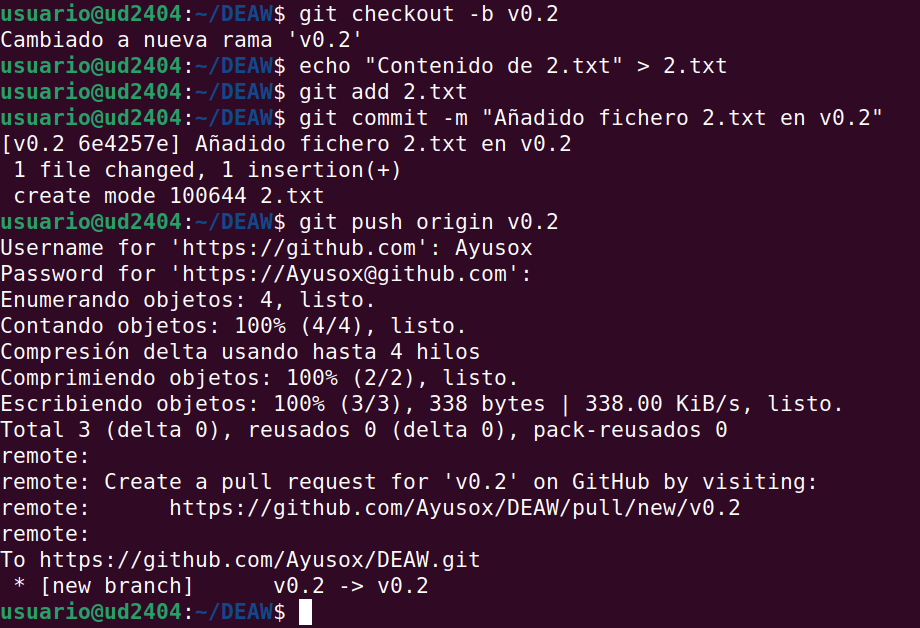

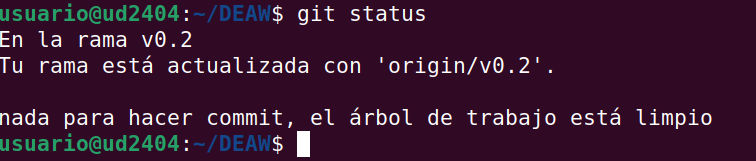

## Merge Directo

Haremos un merge de la rama v0.2 en la rama master.

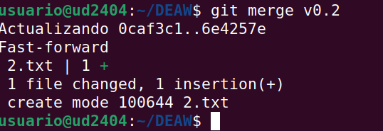

## Merge con conflicto

En la rama master poner Hola en el fichero 1.txt y hacer commit.

Posicionarse en la rama v0.2 y poner Adios en el fichero "1.txt" y hacer commit.

Posicionarse de nuevo en la rama master y hacer un merge con la rama v0.2

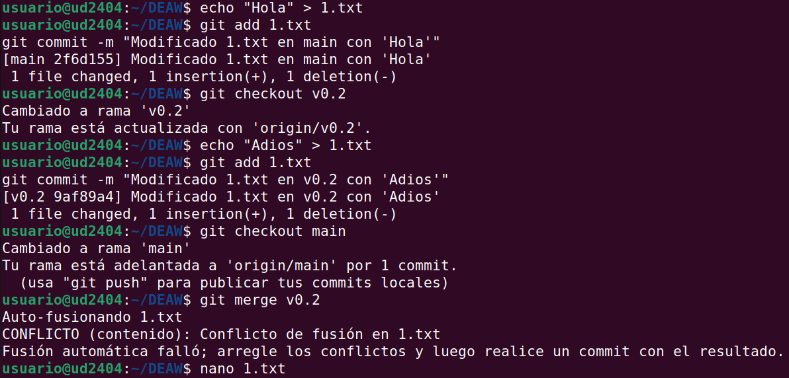

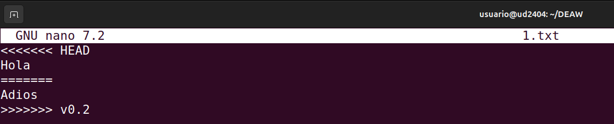

Debemos elegir una versión o combinarlas. por ejemplo podemos cambiar a Hola y adiós.

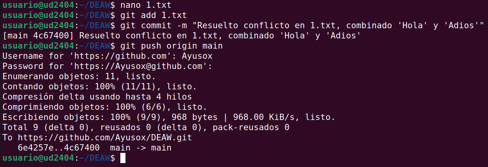

## Listado de ramas

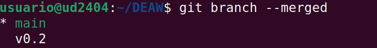

en mi caso, después de hacer el merge, todo se ha fusionado correctamente, y por eso git branch --no-merged no muestra ninguna rama.

Cuando se realiza un merge correcto de la rama v0.2 en main, esa rama ya no aparece como no fusionada

Es normal que v0.2 no aparezca en git branch --no-merged si ya está fusionada.

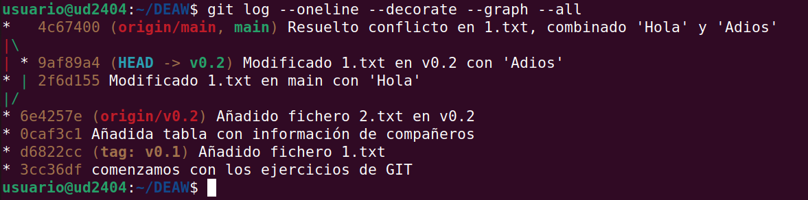

