# **Despliegue de un Sitio Web con Nginx**

## Introducción
En esta práctica, desplegamos un servidor web utilizando **Nginx** en un sistema basado en Debian/Ubuntu. 
A través de la instalación y configuración básica, conseguimos servir un sitio web estático de ejemplo. 

## Paso 1: Instalación de Nginx
Primero, actualizamos los paquetes e instalamos Nginx:

- sudo apt update
- sudo apt install nginx

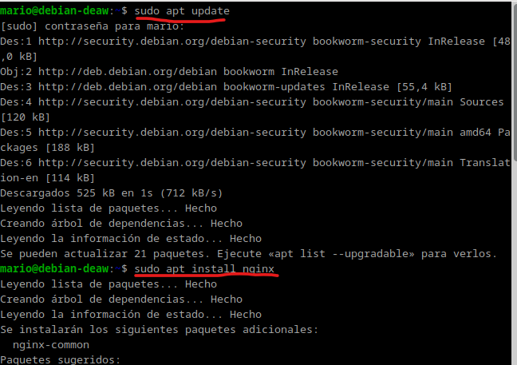

Verificamos que Nginx esté corriendo con el siguiente comando:

- systemctl status nginx

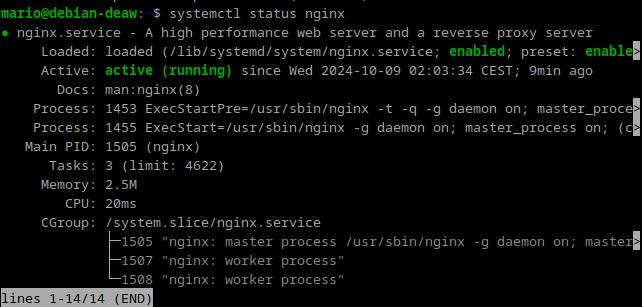

Si todo está bien, debe mostrar que el servicio está activo.

## Paso 2: Creación de las carpeta del sitio web

Ahora necesitamos crear un directorio donde se alojará nuestro sitio web. Normalmente, este se encuentra en /var/www.
Usaremos mkdir para crear una nueva carpeta. 

- sudo mkdir -p /var/www/nombre_web/html

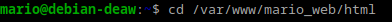

Ahí, dentro de esa carpeta html, debémos clonar el siguiente repositorio:

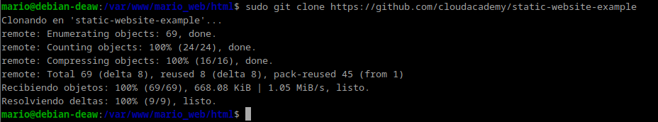

https://github.com/cloudacademy/static-website-example

Es importante cambiar la propiedad de este directorio a www-data, que es el usuario bajo el cual Nginx se ejecuta. Hacemos esto con:

- sudo chown -R www-data:www-data /var/www/nombre_web/html

Luego, ajustamos los permisos para que Nginx tenga acceso adecuado:

- sudo chmod -R 755 /var/www/nombre_web

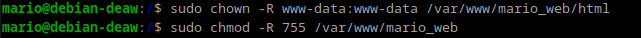

Para comprobar que el servidor está funcionando correctamente:

miramos la ip de la maquina con el siguiente comando

- hostname -I

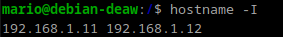

Despues buscamos en internet la ip de la maquina y debería de salir algo tal que así

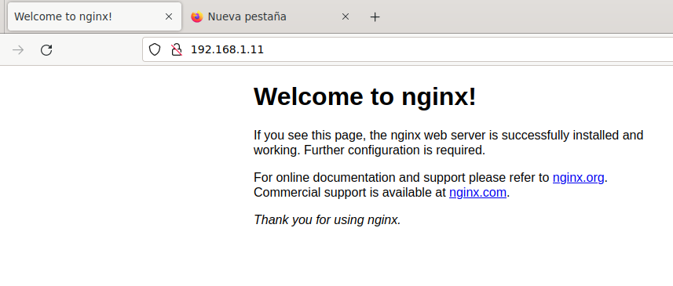

- http://IP-maq-virtual

Lo que muestra que todo está correcto.

## Paso 3: Configuración de servidor web NGINX

El siguiente paso es crear un archivo de configuración para nuestro sitio. Nos dirigimos a la carpeta de configuración de Nginx:

- sudo nano /etc/nginx/sites-available/nombre_web

Para encontrar la ruta deberemos usar el siguiente comando:

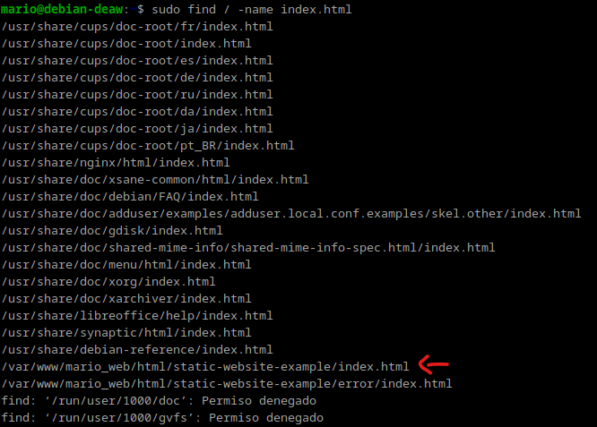

- sudo find / -name index.html

Dentro de este archivo, añadimos lo siguiente:

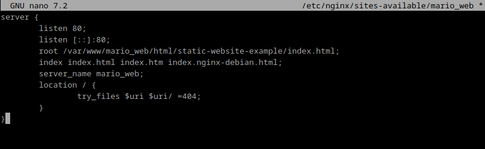

Después de guardar el archivo, necesitamos habilitar este nuevo sitio creando un enlace simbólico en la carpeta sites-enabled:

- sudo ln -s /etc/nginx/sites-available/mi_sitio /etc/nginx/sites-enabled/

Para que los cambios surtan efecto, reiniciamos Nginx con:

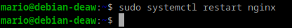

- sudo systemctl restart nginx

## Paso 4: Comprobaciones

Primero añadimos la ip de la maquina virtual en la siguiente ruta

- en Linux: /etc/hosts

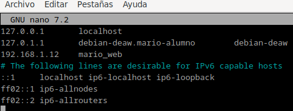

El siguiente paso será añadir la ip nuestro pc en la que estamos usando la maquina para poder conectarnos posteriormente

- en Windows: C:\Windows\System32\drivers\etc\hosts

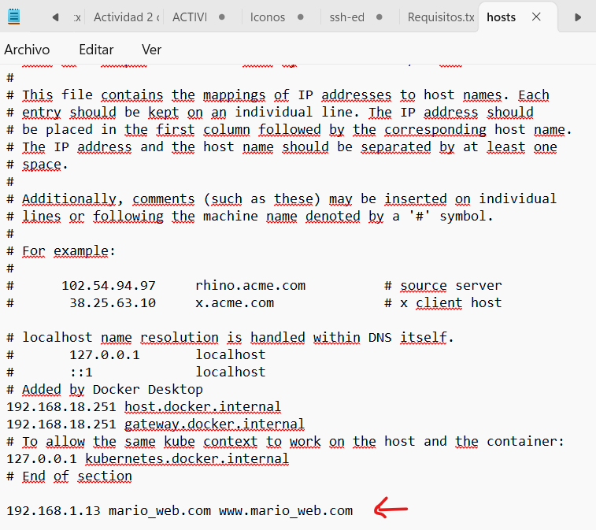

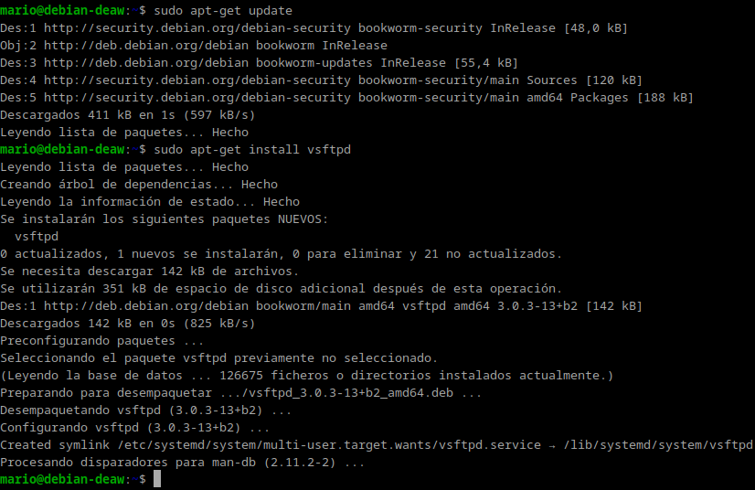

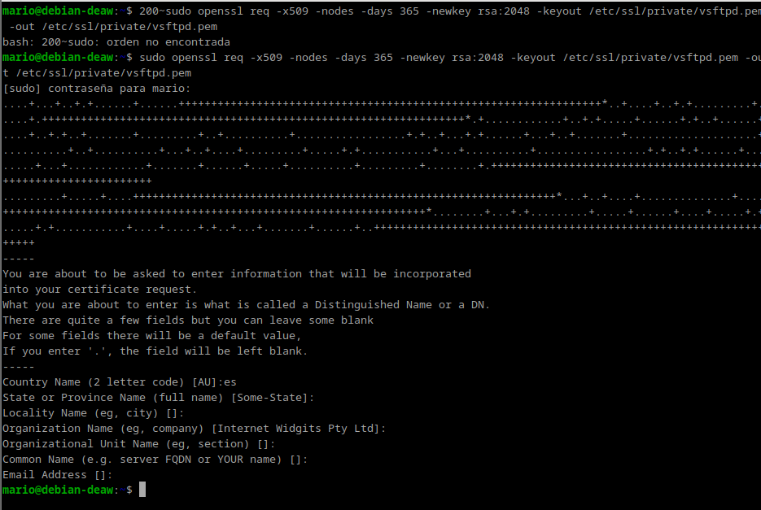

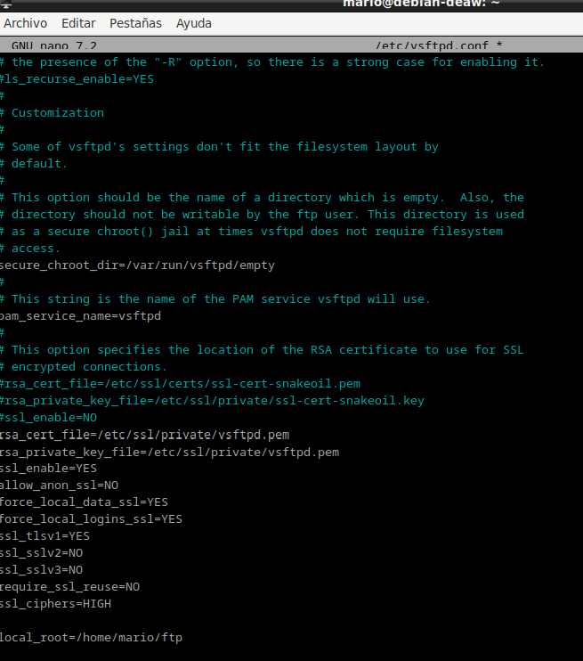

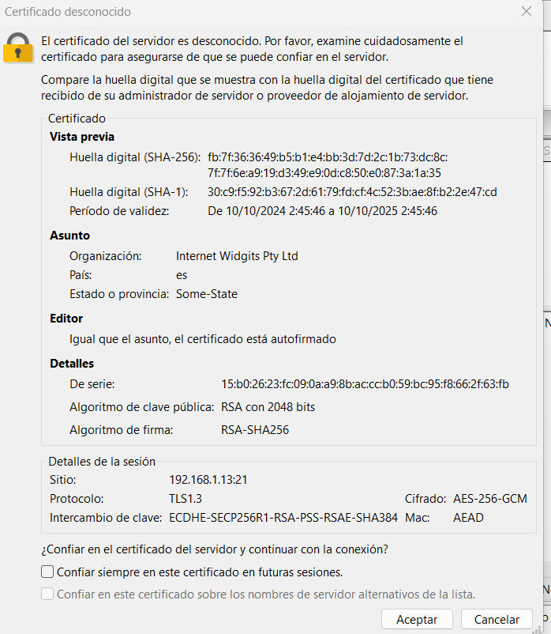

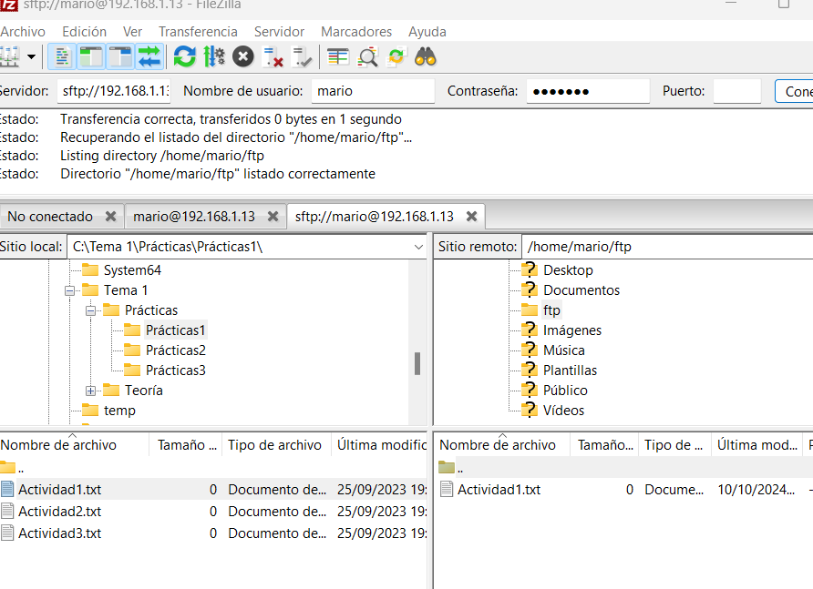

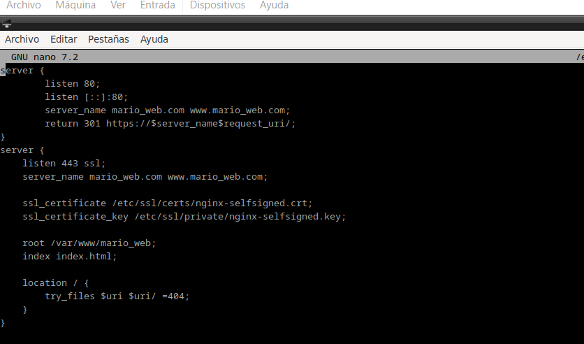

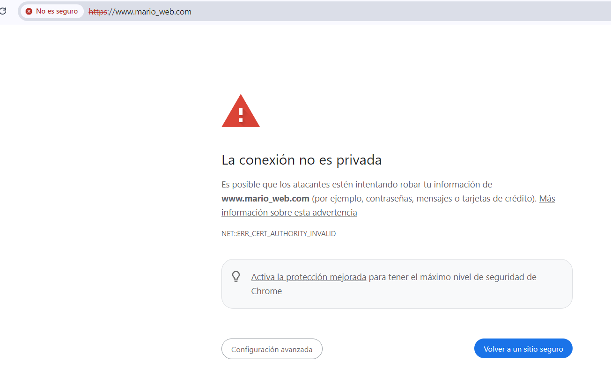

