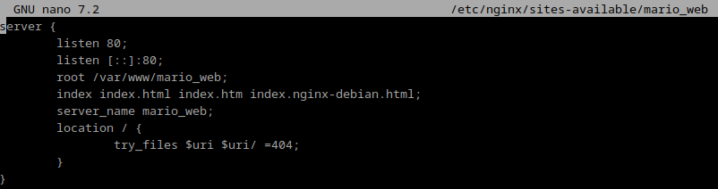
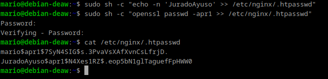

# **Práctica 2.1 - Despliegue de un Sitio Web con Nginx**

## Introducción
En esta práctica, desplegamos un servidor web utilizando **Nginx** en un sistema basado en Debian/Ubuntu. 
A través de la instalación y configuración básica, conseguimos servir un sitio web estático de ejemplo. 

## Paso 1: Instalación de Nginx
Primero, actualizamos los paquetes e instalamos Nginx:

- sudo apt update
- sudo apt install nginx

Verificamos que Nginx esté corriendo con el siguiente comando:

- systemctl status nginx

Si todo está bien, debe mostrar que el servicio está activo.

## Paso 2: Creación de las carpeta del sitio web

Ahora necesitamos crear un directorio donde se alojará nuestro sitio web. Normalmente, este se encuentra en /var/www.
Usaremos mkdir para crear una nueva carpeta. 

- sudo mkdir -p /var/www/nombre_web/html

Ahí, dentro de esa carpeta html, debémos clonar el siguiente repositorio:

https://github.com/cloudacademy/static-website-example

Es importante cambiar la propiedad de este directorio a www-data, que es el usuario bajo el cual Nginx se ejecuta. Hacemos esto con:

- sudo chown -R www-data:www-data /var/www/nombre_web/html

Luego, ajustamos los permisos para que Nginx tenga acceso adecuado:

- sudo chmod -R 755 /var/www/nombre_web

Para comprobar que el servidor está funcionando correctamente:

miramos la ip de la maquina con el siguiente comando

- hostname -I

Despues buscamos en internet la ip de la maquina y debería de salir algo tal que así

- http://IP-maq-virtual

Lo que muestra que todo está correcto.

## Paso 3: Configuración de servidor web NGINX

El siguiente paso es crear un archivo de configuración para nuestro sitio. Nos dirigimos a la carpeta de configuración de Nginx:

- sudo nano /etc/nginx/sites-available/nombre_web

Para encontrar la ruta deberemos usar el siguiente comando:

- sudo find / -name index.html

Dentro de este archivo, añadimos lo siguiente:

Después de guardar el archivo, necesitamos habilitar este nuevo sitio creando un enlace simbólico en la carpeta sites-enabled:

- sudo ln -s /etc/nginx/sites-available/mi_sitio /etc/nginx/sites-enabled/

Para que los cambios surtan efecto, reiniciamos Nginx con:

- sudo systemctl restart nginx

## Paso 4: Comprobaciones

Primero añadimos la ip de la maquina virtual en la siguiente ruta

- en Linux: /etc/hosts

El siguiente paso será añadir la ip nuestro pc en la que estamos usando la maquina para poder conectarnos posteriormente

- en Windows: C:\Windows\System32\drivers\etc\hosts

Ahora pasaremos a la configuración del servidor SFTPD.
En primer lugar, lo instalaremos desde los repositorios:

- sudo apt-get update
- sudo apt-get install vsftpd

El comando sudo apt-get install vsftpd instala el paquete vsftpd, que es un servidor FTP ligero y seguro. 

Despues creamos una carpeta en nuestro home en Debian:
- mkdir /home/mario_web/ftp

En la configuración de vsftpd indicaremos que este será el directorio al cual vsftpd se cambia después de conectarse el usuario.

El siguiente paso será crear los certificados de seguridad necesarios para aportar la capa de cifrado a nuestra conexión.

Usaremos el siguiente comando para la configuración de vsftpd.

- sudo nano /etc/vsftpd.conf

Dentro de la configuración de vsftpd añadiremos lo siguiente que se muestra en la imagen.
Esta configuración asegura que las conexiones FTP sean seguras usando FTPS (FTP sobre SSL/TLS).
Esto cifra tanto la autenticación como la transferencia de archivos, protegiendo los datos de posibles intercepciones.

Ya hemos terminado con la configuración. 
Ahora podremos acceder a nuestro servidor mediante un cliente FTP descargando filezilla client en el cliente

Entramos en filezilla e introducimos los datos necesarios para conectarnos a nuestro servidor FTP en Debian

- IP de la maquina servidor
- Nombre
- Contraseña
- Puerto, que será el 21

Como muestro en la imagen ya conectado a la maquina principal he pasado un archivo txt para combrobar que funciona correctamente.

Por ultimo modificaremos la configuración del servidor web con Nginx, para poder mostrar la pagina final.

Este archivo configura mi servidor web que sirve contenido estático desde /var/www/mario_web y asegura la conexión usando HTTPS.
El puerto 80 redirige automáticamente al 443 (HTTPS) para garantizar conexiones seguras.

Para comprobar que la configuración está correctamente y nos muestra la página,
escribiremos en internet "https://www.mario_web.com/""

Nos saldra un mensaje de advertencia, para poder visualizar la pagina pincharemos en "configuración avanzada" y despues en "Acceder a www.mario_web.com (sitio no seguro)""

Finalmente visualizará la pagina final mostrando que todo el proceso realizado está correcto

# **Práctica 2.2 - Autenticación en Nginx**

## Introducción
La práctica 2.2 trata sobre cómo configurar autenticación básica en un servidor Nginx.
El objetivo es proteger el acceso a ciertos recursos web usando usuarios y contraseñas.
Se trabaja con la creación del archivo .htpasswd para almacenar credenciales cifradas, se configuran las directivas de autenticación en Nginx,
y se realizan pruebas para asegurar que la autenticación funcione. 
También se explora cómo combinar autenticación con restricciones por IP. 
La práctica incluye tareas como modificar la configuración y analizar los logs de acceso.

Paquetes necesarios:

En primer lugar debemos comprobar si el paquete está instalado con el siguiente comando:

- dpkg -l | grep openssl

Y si no lo estuviera, instalarlo.

### Creación de usuarios y contraseñas para el acceso web

Crearemos un archivo oculto llamado “.htpasswd” en el directorio de configuración /etc/nginx donde guardar nuestros usuarios y contraseñas:

Ahora crearemos un pasword cifrado para el usuario:

Nos pedirá la contraseña que queramos y verificarla.

Crearemos otro usuario con mis apellidos y con el siguiente comando se mostrarán las contraseñas cifradas

- cat /etc/nginx/.htpasswd

### COMPROBACIÓN 1

Al entrar en nuestra web nos pedirá el usuario y contraseña.

### COMPROBACIÓN 2

En caso de no poder acceder mostrará los siguiente

### TAREA 1

Aquí se muestra 3 intentos fallidos de autenticación usando el siguiente comando:

- sudo nano /var/log/nginx/error.log

### TAREA 2
Borramos las dos líneas que hacen referencia a la autenticación básica en el location del directorio raíz.

Despues, añadimos un nuevo location debajo con la autenticación básica para el archivo/sección contact.html únicamente.

Al haber hecho esto solo podremos acceder al apartado de "contact"

### Combinación de la autenticación básica con la restricción de acceso por IP

### Tarea 1

Entraremos en el archivo de configuración y añadiremos el deny junto a la dirección IP 

Cuando configuramos Nginx con autenticación básica, cualquier intento fallido de acceder con credenciales incorrectas se registra en los logs. En este caso, primero intentaremos acceder con un usuario no válido y luego con uno correcto.

Nos mostrará el siguiente error:

Para ver los usuarios que han accedido correctamente a la pagina sería usando el siguiente comando:

- sudo cat /var/log/nginx/access.log

### Tarea 2

Para esta tarea haremos lo mismo pero añadiendo lo siguiente:

nginx
location / {
    satisfy all;
    allow 192.168.1.0/24;
    deny all;
    auth_basic "Área restringida";
    auth_basic_user_file /etc/nginx/.htpasswd;
}

Ahora si nos dejará acceder a la página ya que no se deniega la ip.

### Cuestiones Finales

### Cuestion 1

Si yo tengo la IP 172.1.10.15 y estoy intentando acceder al directorio /web_muy_guay con un usuario y contraseña incorrectos, no podré acceder. Esto se debe a que en la configuración del bloque location se usa la directiva satisfy all, lo que significa que tanto la autenticación básica como la restricción por IP deben cumplirse. Aunque mi IP está permitida (allow 172.1.10.15), al equivocarme con las credenciales, no cumplo con la autenticación básica, y por lo tanto el acceso será denegado.

### Cuestion 2
Si ahora intento acceder al directorio /web_muy_guay con mi IP (172.1.10.15) e ingreso correctamente el usuario y contraseña, sí podré acceder. En este caso, la directiva sigue siendo satisfy all, por lo que ambas condiciones (IP permitida y autenticación exitosa) deben cumplirse. Mi IP está permitida y al haber introducido correctamente las credenciales, cumplo con los dos requisitos, por lo que podré entrar sin problemas.

### Cuestion 3

En este caso, aunque introduzca correctamente el usuario y la contraseña, no podré acceder. La razón es que la directiva satisfy any permite que se cumpla solo una de las condiciones (autenticación o IP permitida) para permitir el acceso. Sin embargo, en la configuración se ha añadido una regla que deniega el acceso a mi IP (deny 172.1.10.15), lo que bloquea mi acceso incluso si la autenticación es exitosa. La regla de denegación de la IP tiene prioridad en este caso, así que el acceso es bloqueado.

### Cuestion 4

Para proteger el directorio /Proyectos de mi web, lo que haría sería añadir un bloque location específico para ese directorio, con autenticación básica. La configuración quedaría algo así:

nginx
server {
    listen 80;
    listen [::]:80;
    root /var/www/freewebsitetemplates.com/preview/space-science;
    index index.html index.htm index.nginx-debian.html;
    server_name freewebsitetemplates.com www.freewebsitetemplates.com;

    location / {
        try_files $uri $uri/ =404;
    }

    location /Proyectos {
        auth_basic "Área restringida - Proyectos";
        auth_basic_user_file /etc/nginx/conf.d/htpasswd_proyectos;
    }
}

Aquí lo que hago es configurar el acceso restringido para el directorio /Proyectos usando la autenticación básica con un archivo de contraseñas (htpasswd). De esta forma, solo quienes tengan el usuario y la contraseña correcta podrán acceder al directorio.

