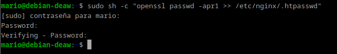
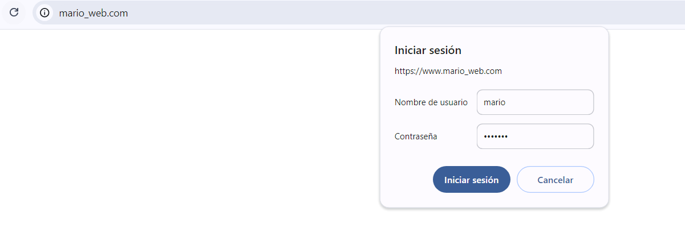
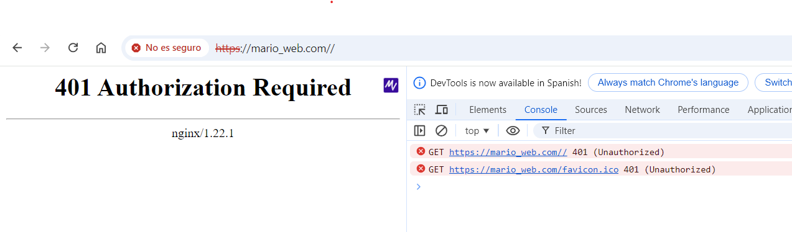
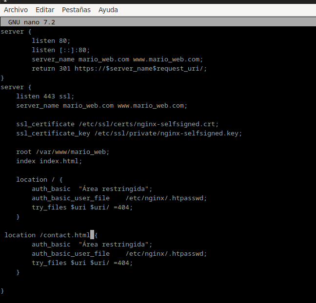
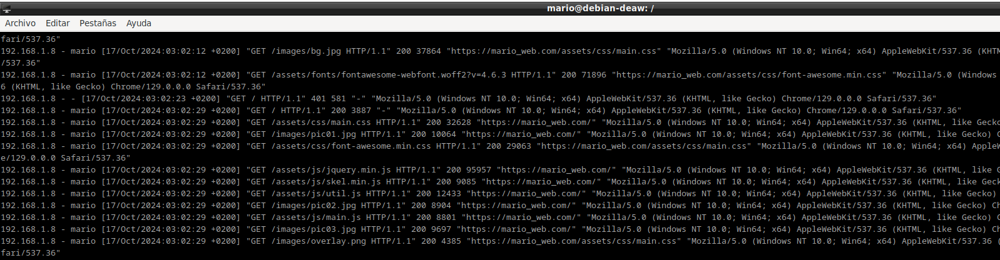

# **Práctica 2.2 - Autenticación en Nginx**

## Introducción
La práctica 2.2 trata sobre cómo configurar autenticación básica en un servidor Nginx.
El objetivo es proteger el acceso a ciertos recursos web usando usuarios y contraseñas.
Se trabaja con la creación del archivo .htpasswd para almacenar credenciales cifradas, se configuran las directivas de autenticación en Nginx,
y se realizan pruebas para asegurar que la autenticación funcione. 
También se explora cómo combinar autenticación con restricciones por IP. 
La práctica incluye tareas como modificar la configuración y analizar los logs de acceso.

Paquetes necesarios:

En primer lugar debemos comprobar si el paquete está instalado con el siguiente comando:

- dpkg -l | grep openssl

Y si no lo estuviera, instalarlo.

### Creación de usuarios y contraseñas para el acceso web

Crearemos un archivo oculto llamado “.htpasswd” en el directorio de configuración /etc/nginx donde guardar nuestros usuarios y contraseñas:

Ahora crearemos un pasword cifrado para el usuario:

Nos pedirá la contraseña que queramos y verificarla.

Crearemos otro usuario con mis apellidos y con el siguiente comando se mostrarán las contraseñas cifradas

- cat /etc/nginx/.htpasswd

### COMPROBACIÓN 1

Al entrar en nuestra web nos pedirá el usuario y contraseña.

### COMPROBACIÓN 2

En caso de no poder acceder mostrará los siguiente

### TAREA 1

Aquí se muestra 3 intentos fallidos de autenticación usando el siguiente comando:

- sudo nano /var/log/nginx/error.log

### TAREA 2
Borramos las dos líneas que hacen referencia a la autenticación básica en el location del directorio raíz.

Despues, añadimos un nuevo location debajo con la autenticación básica para el archivo/sección contact.html únicamente.

Al haber hecho esto solo podremos acceder al apartado de "contact"

### Combinación de la autenticación básica con la restricción de acceso por IP

### Tarea 1

Entraremos en el archivo de configuración y añadiremos el deny junto a la dirección IP 

Cuando configuramos Nginx con autenticación básica, cualquier intento fallido de acceder con credenciales incorrectas se registra en los logs. En este caso, primero intentaremos acceder con un usuario no válido y luego con uno correcto.

Nos mostrará el siguiente error:

Para ver los usuarios que han accedido correctamente a la pagina sería usando el siguiente comando:

- sudo cat /var/log/nginx/access.log

### Tarea 2

Para esta tarea haremos lo mismo pero añadiendo lo siguiente:

Ahora si nos dejará acceder a la página ya que no se deniega la ip.

### Cuestiones Finales

### Cuestion 1

Si yo tengo la IP 172.1.10.15 y estoy intentando acceder al directorio /web_muy_guay con un usuario y contraseña incorrectos, no podré acceder. Esto se debe a que en la configuración del bloque location se usa la directiva satisfy all, lo que significa que tanto la autenticación básica como la restricción por IP deben cumplirse. Aunque mi IP está permitida (allow 172.1.10.15), al equivocarme con las credenciales, no cumplo con la autenticación básica, y por lo tanto el acceso será denegado.

### Cuestion 2
Si ahora intento acceder al directorio /web_muy_guay con mi IP (172.1.10.15) e ingreso correctamente el usuario y contraseña, sí podré acceder. En este caso, la directiva sigue siendo satisfy all, por lo que ambas condiciones (IP permitida y autenticación exitosa) deben cumplirse. Mi IP está permitida y al haber introducido correctamente las credenciales, cumplo con los dos requisitos, por lo que podré entrar sin problemas.

### Cuestion 3

En este caso, aunque introduzca correctamente el usuario y la contraseña, no podré acceder. La razón es que la directiva satisfy any permite que se cumpla solo una de las condiciones (autenticación o IP permitida) para permitir el acceso. Sin embargo, en la configuración se ha añadido una regla que deniega el acceso a mi IP (deny 172.1.10.15), lo que bloquea mi acceso incluso si la autenticación es exitosa. La regla de denegación de la IP tiene prioridad en este caso, así que el acceso es bloqueado.

### Cuestion 4

Para proteger el directorio /Proyectos de mi web, lo que haría sería añadir un bloque location específico para ese directorio, con autenticación básica. La configuración quedaría algo así:

nginx
server {
    listen 80;
    listen [::]:80;
    root /var/www/freewebsitetemplates.com/preview/space-science;
    index index.html index.htm index.nginx-debian.html;
    server_name freewebsitetemplates.com www.freewebsitetemplates.com;

    location / {
        try_files $uri $uri/ =404;
    }

    location /Proyectos {
        auth_basic "Área restringida - Proyectos";
        auth_basic_user_file /etc/nginx/conf.d/htpasswd_proyectos;
    }
}

Aquí lo que hago es configurar el acceso restringido para el directorio /Proyectos usando la autenticación básica con un archivo de contraseñas (htpasswd). De esta forma, solo quienes tengan el usuario y la contraseña correcta podrán acceder al directorio.

