# **Práctica 2.3 - Proxy inverso con Nginx**

## Clonar la máquina virtual

Lo primero que tenemos que hacer es tomar la máquina virtual ya configurada en las prácticas anteriores y la clonamos. 
Tendremos ahora dos máquinas: una que actuará como servidor web y la otra como proxy inverso.

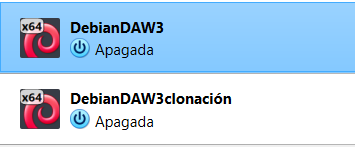

Al clonar, es importante generar una nueva dirección MAC para que ambas máquinas tengan direcciones IP diferentes y no haya conflictos en la red.

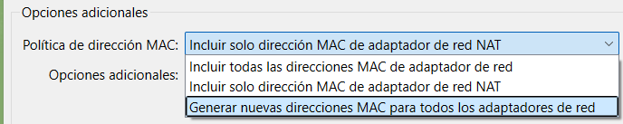

## Nginx servidor web

Primero modificamos el archivo de configuración de Nginx en /etc/nginx/sites-available/webserver (o creamos uno nuevo).
Dentro, cambiamos la línea de listen 80 a listen 8080.

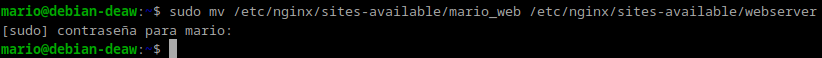

En el servidor web, cambiamos el puerto de escucha en Nginx.
En vez del puerto 80, lo configuramos para que escuche en el puerto 8080.

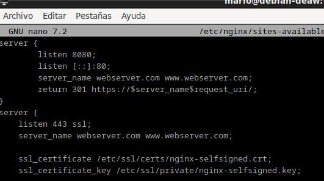

Luego, eliminamos el enlace simbólico actual en /etc/nginx/sites-enabled/ y creamos uno nuevo apuntando al archivo que acabamos de modificar.

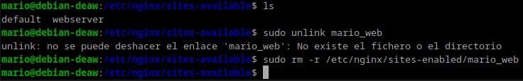

Finalmente, reiniciamos Nginx para aplicar los cambios con sudo systemctl restart nginx

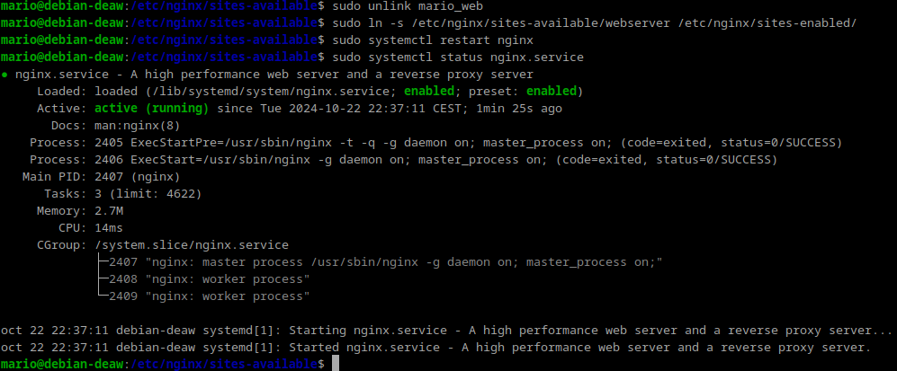

## Configurar el proxy inverso
Primero debemos modificar el arhivo de configuracion de la maquina servidorweb en el archivo host de la maquina proxy. 

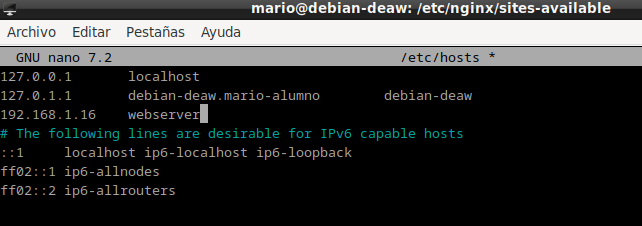

En la máquina que funcionará como proxy inverso, creamos un archivo de configuración en /etc/nginx/sites-available/ejemplo-proxy.

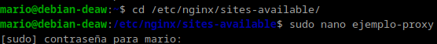

Aquí, añadimos una directiva proxy_pass que redirija las solicitudes al servidor web, usando su dirección IP y el puerto 8080 que configuramos antes.
Esto hará que cualquier solicitud que llegue al proxy en el puerto 80 sea redirigida a nuestro servidor web.

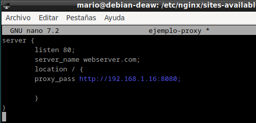

Habilitamos el sitio creando un enlace simbólico en /etc/nginx/sites-enabled/ejemplo-proxy y Reiniciamos el servicio Nginx.

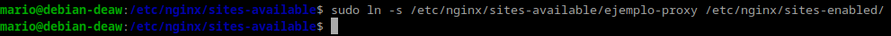

A continuación se procederá a modificar el archivo hosts de la maquina anfitriona para que la ip coincida con la de la maquina de webserver

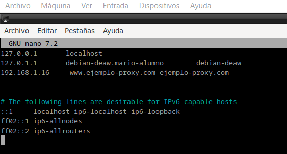

## Realizar pruebas
Para comprobar que todo funciona, abrimos el navegador e ingresamos la IP del proxy (o el nombre de dominio, si lo tenemos configurado).
Las solicitudes que llegan al proxy deben ser redirigidas automáticamente al servidor web.

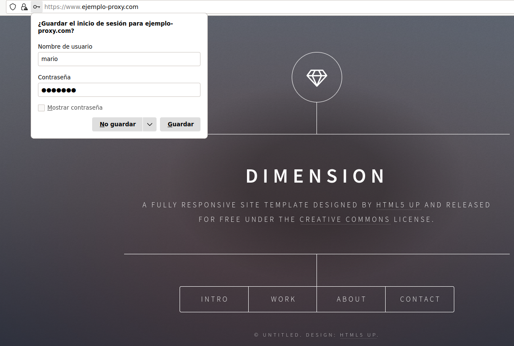

Si todo está bien configurado, al hacer la solicitud deberíamos ver el contenido servido desde el servidor web

## Cabeceras

Para añadir cabeceras, en el archivo de configuración del sitio web debemos añadir dentro del bloque location / { … } debemos añadir lo siguiente:
- add_header Host nombre_del_host;

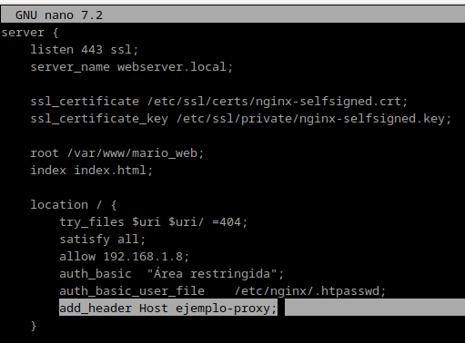

Aquí se muestra el resultado final

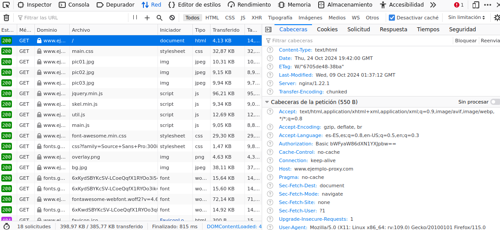

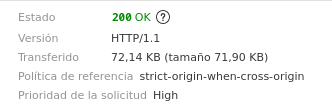