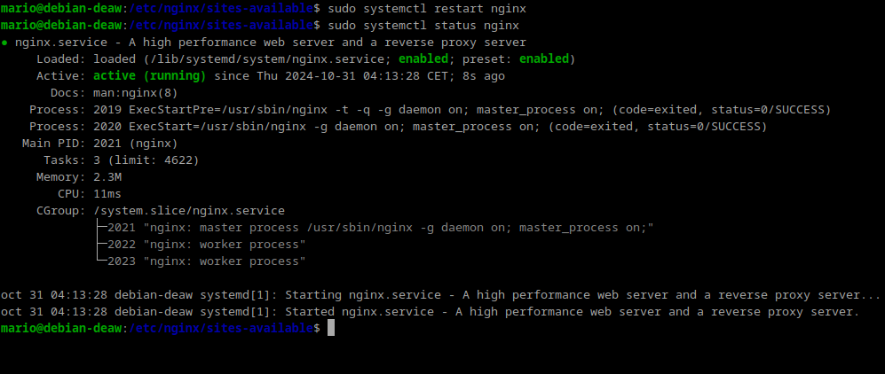
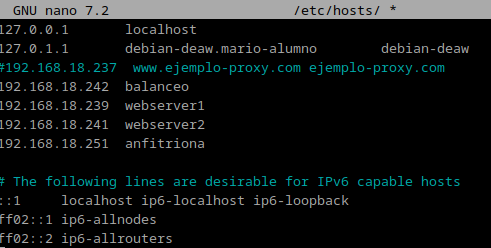

# **Práctica 2.4 - Proxy inverso con balanceo de carga con Nxginx**

## Introducción

Esta práctica introduce el concepto de balanceo de carga mediante un proxy inverso con Nginx.
Aquí veremos cómo distribuir tráfico entre varios servidores, lo que mejora la disponibilidad y eficiencia del servicio web.
El objetivo es configurar un proxy inverso que reparta las solicitudes entre dos servidores diferentes, de manera que se garantice el acceso incluso si uno de ellos falla.
Además, se explorarán varios métodos de balanceo para entender cuál es más efectivo en distintas situaciones.

##CONFIGURACIÓN DE LOS SERVIDORES WEB

- Webserver1:

Desactivamos los sitios web de las practicas anteriores


Lo Primero que haremos será cambiarle el nombre al archivo de conf


Despues le quitaremos el link simbolico anterior lo volvemos a crear y reiniciamos el servicio de nginx.


Creamos el archivo de configuracion para webserver1 en la carpeta /etc/nginx/sites-available y enlazamos a sites-enabled
```
server {
    listen 8080;
    server_name webserver1;

    root /var/www/webserver1/html;
    index index.html;

    add_header Serv_Web1 "tu_nombre";

    location / {
        try_files $uri $uri/ =404;
    }
}
```
Después de poner esto en el archivo /etc/nginx/sites-available/webserver1 enlazamos a sites-enables con el siguiente comando.


Lo siguiente será Crear el directorio /var/www/webserver1/html y creamos en él, el archivo index.html

```html
<html lang="es">
<head>
    <title>Prueba de balanceo de carga con Nginx</title>
</head>
<body>
    <h2>Este es el servidor web 1</h2>
    <p>Comprueba el balanceo de carga con Nginx recargando esta página</p>>
</body>
</html>
```


reiniciamos y comprobamos el servidor nginx


Una vez hecho todo esto podemos pasar a clonar la maquina virtual.

- Webserver2:
Aqúi solamente habrá que repetir el proceso que ya hemos hecho pero cambiando webserver1 por Webserver2.

Modificamos configuración


modificamos index.html


por ultimo reiniciamos y comprobamos el servidor nginx



##CONFIGURACIÓN DEL PROXY INVERSO

Entramos en la máquina que configuramos el proxy inverso en la práctica anterior

### balanceo de carga
Primero, creamos el archivo en /etc/nginx/sites-available/ con el nombre balanceo:

- sudo nano /etc/nginx/sites-available/balanceo

Configurarmos el contenido: Dentro de este archivo, definimos un bloque upstream y especificamos los servidores para el balanceo de carga.

Dentro estan incluidas las 2 ip de cada maquina.


Crea un enlace simbólico para habilitar la configuración y reiniciamos nginx.


Hasta aquí todo bien


## CONFIGURACIÓN DE /ETC/HOSTS
- Webserver1



- Webserver2


- Proxy inverso


## RESULTADO
Al entrar en http://balanceo nos mostrara las pagina que muestra.


## Cuestiones finales

### Cuestión 1
Métodos de balanceo de carga en Nginx:

Round Robin: Envía solicitudes a los servidores en un orden cíclico.
Least Connections: Dirige las solicitudes al servidor con la menor cantidad de conexiones activas.
IP Hash: Utiliza la dirección IP del cliente para dirigir las solicitudes, asegurando que un cliente específico siempre acceda al mismo servidor.

###Cuestión 2

Añadir servidores al balanceo de carga:

Actualizar el bloque upstream en la configuración de Nginx para incluir las nuevas direcciones IP de los servidores. Ejemplo:

nginx
Copiar código
upstream backend_hosts {
    server 192.168.18.239:8080;
    server 192.168.18.243:8080;
    server 192.168.18.250:8080;  # nuevo servidor
    server 192.168.18.251:8080;  # nuevo servidor
}
Reiniciar Nginx con sudo systemctl restart nginx.

### Cuestión 3

Pasos para implementar balanceo de carga:

Preparar los servidores web asegurándose de que estén configurados y escuchando en el puerto adecuado (ej. 8080).
Configurar el proxy inverso en Nginx, creando un bloque upstream y un servidor que escuche en el puerto 80.
(Opcional) Modificar el archivo /etc/hosts para facilitar el acceso al balanceador por nombre.
Reiniciar Nginx.
Probar la configuración accediendo a la URL del balanceador.
