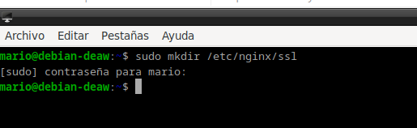
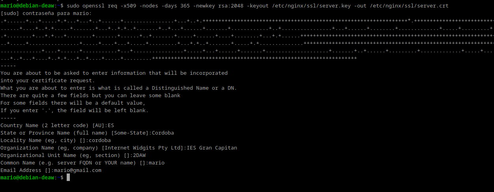
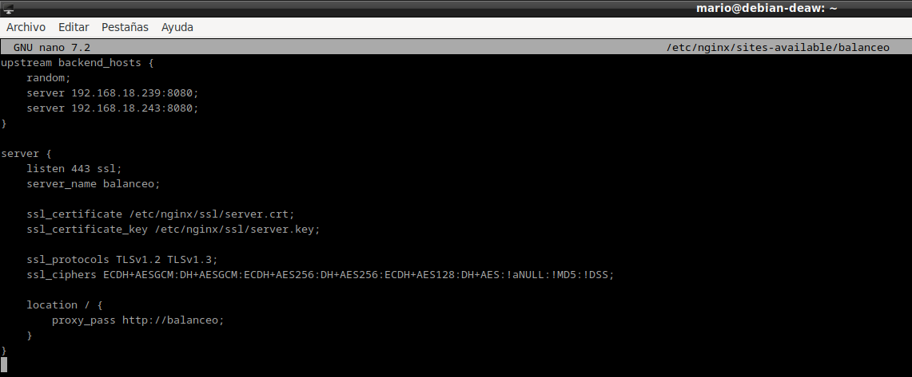
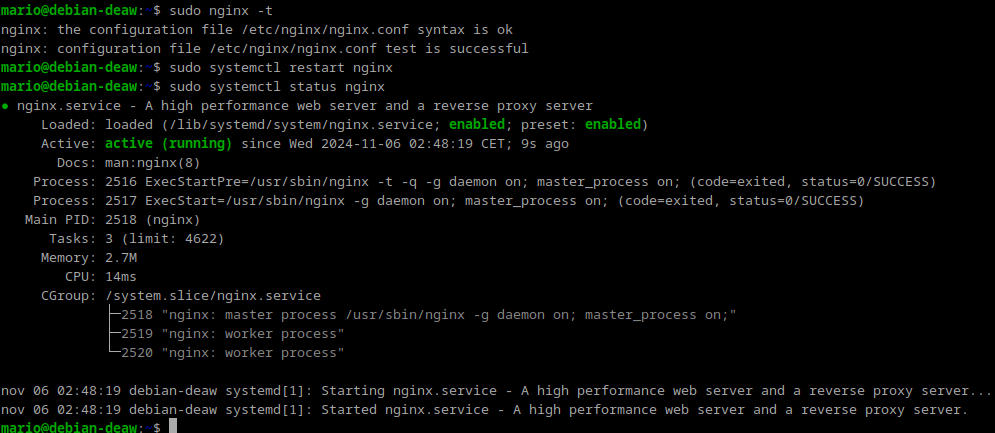
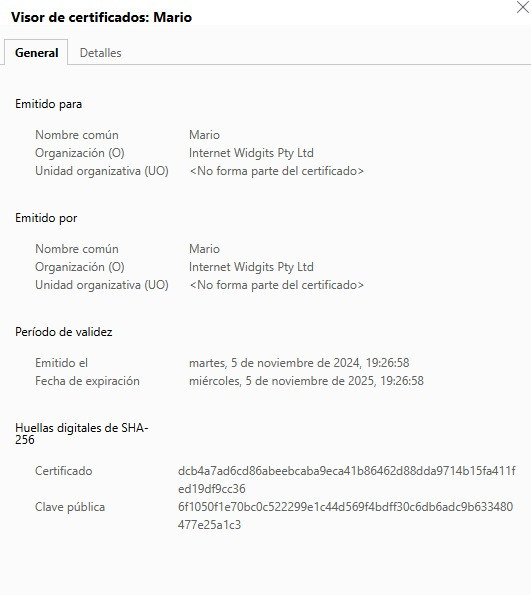
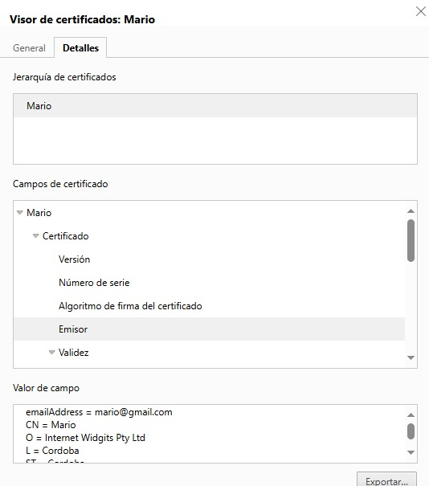
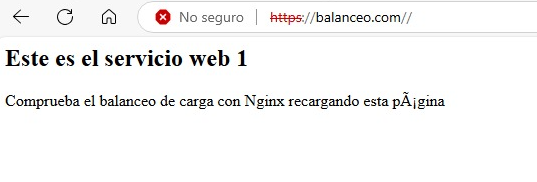
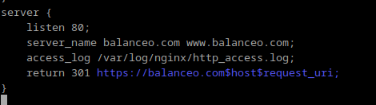

# **Práctica 2.4 - Proxy inverso y balanceo de carga con SSL en NGINX**

## Creación de certificado autofirmado

Para esta practica vamos a necesitar un certificado SSL autofirmado

Primero, dentro del directorio de NGINX (/etc/nginx/), creamos una carpeta llamada ssl para guardar los archivos SSL.
Luego, con el comando openssl, generamos un certificado y una clave privada.
Esto es un certificado “autofirmado”, o sea, no es de una entidad oficial. Lo usamos solo para pruebas.

## Configuración SSL en el proxy inverso

En el archivo /etc/nginx/sites-available/balanceo, agregamos la configuración para que NGINX escuche en el puerto 443 (para HTTPS).
Añadimos las rutas al certificado y la clave privada, y definimos los protocolos y cifrados de SSL que permitimos.Esto asegura que el tráfico esté cifrado.

reiniciamos el servidor para aplicar los cambios

## Comprobaciones
Probamos accediendo al sitio en HTTPS. Veremos una advertencia del navegador sobre el certificado autofirmado, pero es normal.

accedemos a la sección de ver certificado, donde se mostrará toda la configuración y sus claves.

### Redirección forzosa a HTTPS
Para configurar una redirección forzosa de HTTP a HTTPS en NGINX, agregamos un bloque server que escuche en el puerto 80 y redirija automáticamente a HTTPS:

**listen 80;** indica que este bloque escucha en el puerto HTTP.

**return 301** https://$host$request_uri; hace una redirección permanente a HTTPS manteniendo el mismo dominio y URL.

Se deberá de modificar el archivo de configuración del proxy-inverso como se muestra en la siguiente imagen.

## Cuestiones finales
### Cuestion 1

Si tienes el error ERR_SSL_PROTOCOL_ERROR, es porque falta un detalle: en la configuración, donde dice listen 443;, debe estar escrito como listen 443 ssl;. Sin ese ssl, NGINX no sabe que quieres usar SSL en ese puerto, así que el sitio no se carga.

### Cuestion 2

El error ERR_CERT_REVOKED ocurre cuando el certificado SSL ha sido revocado, lo cual puede suceder si el proveedor de certificados lo ha invalidado debido a problemas de seguridad, caducidad o alguna irregularidad detectada.

Para solucionarlo:

Verificar el estado del certificado: Usar herramientas como SSL Labs para ver el estado del certificado.
Renovar el certificado: Si el certificado ha caducado, solicitar una renovación a la autoridad emisora.
Revisar la configuración de NGINX: Asegurarnos de estar usando el certificado correcto y que esté actualizado.
