# **Práctica 3.1: Instalación de Tomcat y Maven para despliegue de aplicación Java**
## Instalación y Despliegue Tomcat
Lo primero que haremos será Descargar Apache Tomcat 10 y extraerlo en nuestra máquina. 
Podemos configurarlo para que funcione en el puerto 8080 (predeterminado).
Descargamos el JDK con el siguiente comando

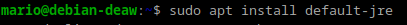

comprobaremos la versión instalada 

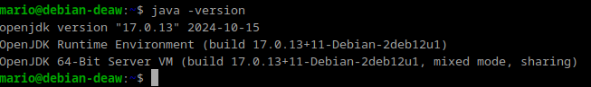

Seguiremos con la instalación de Tomcat con el siguiente comando

El siguiente paso será configurar el archivo tomcat-users.xml en la carpeta de Tomcat para crear un usuario con roles de administrador (manager-gui) y de despliegue (manager-script).

- sudo nano /etc/tomcat10/tomcat-users.xml

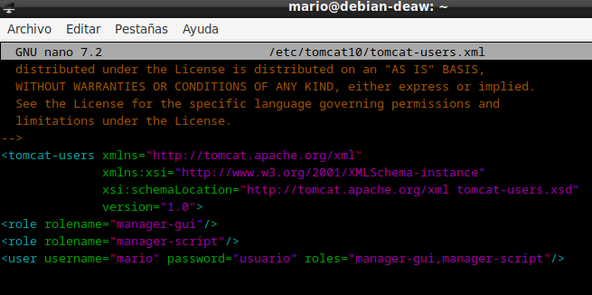

Hecho este paso pasaremos a reiniar el servicio de Tomcat con el comando `sudo systemctl restart tomcat`. Para comprobar que el servicio se ha iniciado correctamente, se ejecutará el comando `sudo systemctl status tomcat` y debera aparecer algo similar a lo siguiente:
Que como se puede comprobar el servicio de tomcat esta activo y correcto.

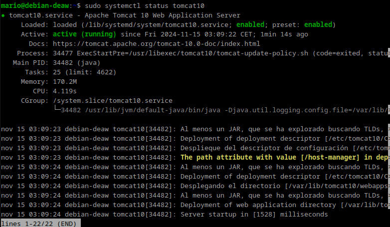

Cambie mi nombre a "manager" porque me daba errores.

Accedemos a la dirección `http://localhost:8080/nombre_usuario/html` nos solicitará usuario y contraseña y nos mostrará lo siguiente:

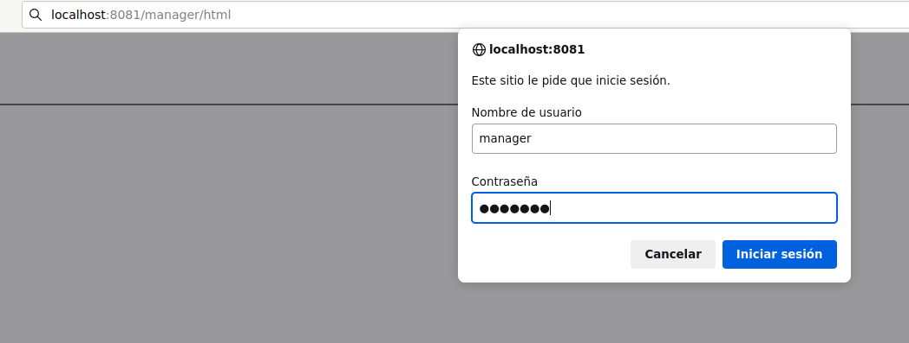

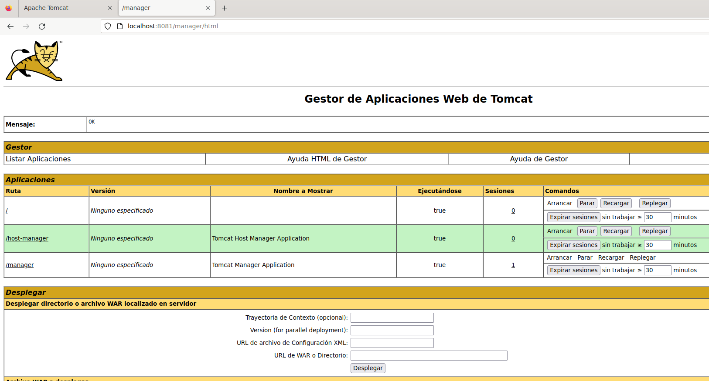

Ahora pasaremos a desplegar un un archivo .war en Tomcat.
El archivo .war de la entrega cotiene errores, por lo que elegiré un archivo .war con un proyecto de ejemplo.

Desde el siguiente enlace se descargará el proyecto de ejemplo: `https://tomcat.apache.org/tomcat-6.0-doc/appdev/sample/`

Selecionamos el archivo war y le damos a desplegar

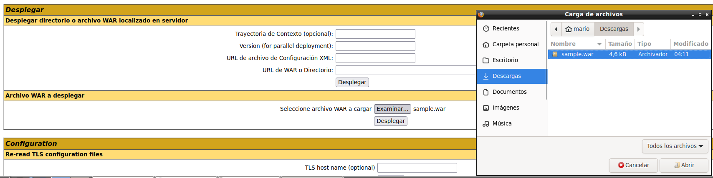

Nos mostrará el archivo desplegado

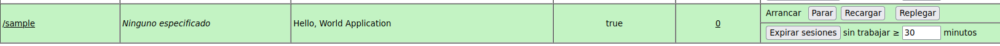

podremos acceder al archivo

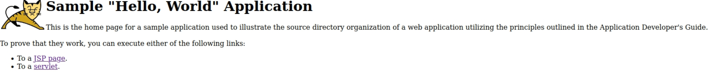

## Instalación y Despliegue Maven

El primer paso será instalar maven

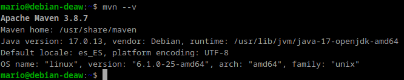

Añadiermos un nuevo usuario para maven en el archivo `tomcat-users.xml` para poder usarlo a la hora de desplegar maven

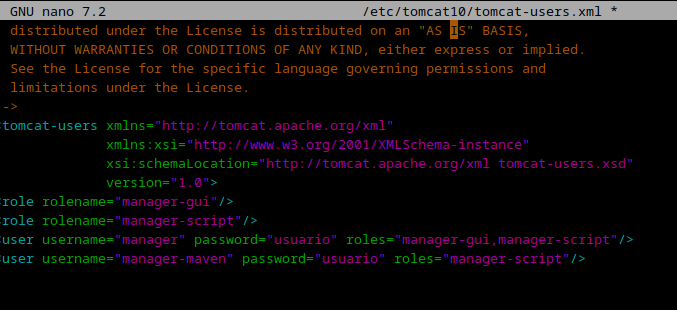

lo siguiente será configurar Maven, modificaremos el archivo `settings.xml` y Debería quedar tal que así:

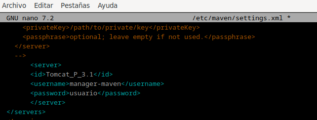

Y se clona el repositorio de ejemplo facilitado para desplegarlo con Maven.

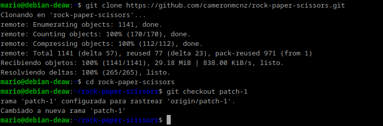

Por ultimo se editará el archivo `pom.xml` y la configuración. Como se muestra:

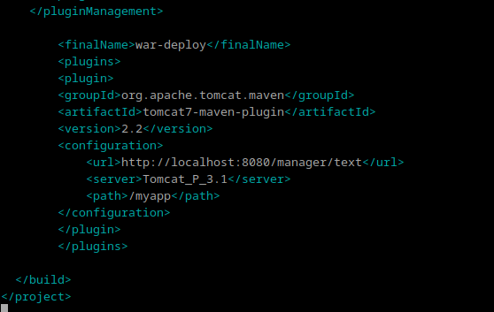

Si todo está correcto y ejecutamos el comando `mvn tomcat7:deploy` deberá aparecer algo así:

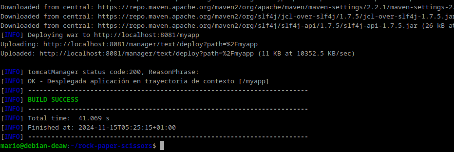

Si accedemos a la dirección `http://localhost:8080/nombre_usuario/` nos mostrará correctamente

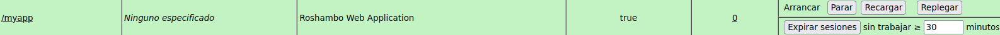

podremos acceder al archivo final.

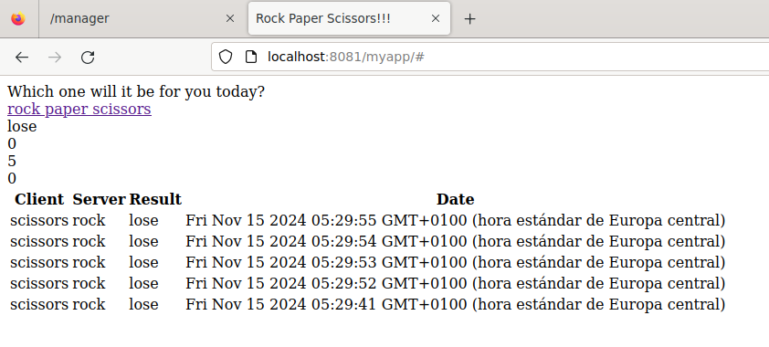

## Cuestiones

*Solución:*

Esto se debe a la facilidad de configuración y a la presunción de que Tomcat se empleará en entornos seguros y bien gestionados. Sin embargo, en entornos de producción, se aconseja evitar esta práctica mediante el uso de autenticación externa.

