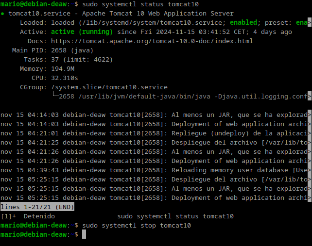
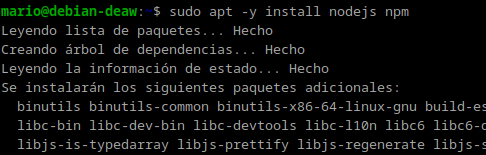
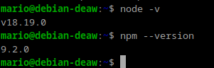
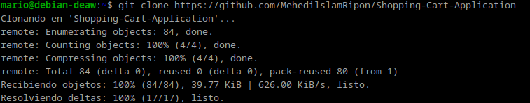
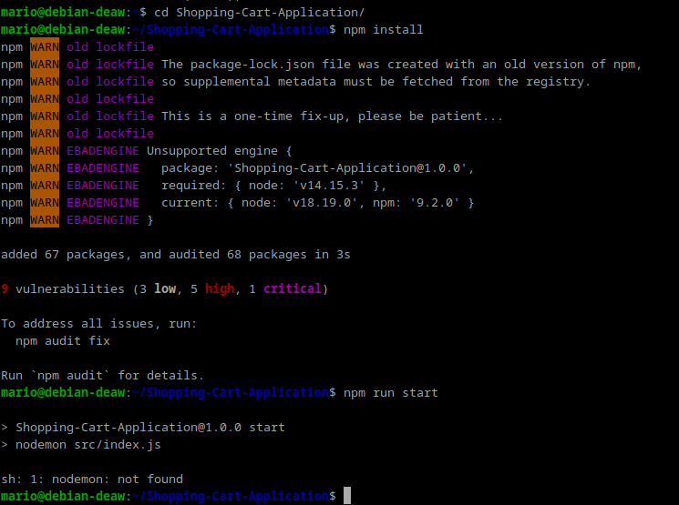
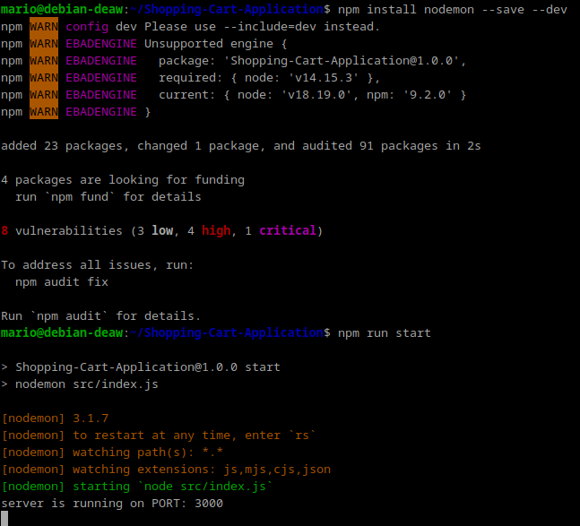
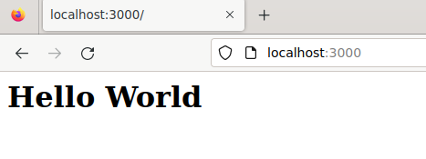

# **Práctica 3.2: Despliegue de aplicaciones con Node Express**

## Introducción

En esta práctica despleguaremos aplicaciones con Node Express.

Lo pimero será parar el servicio de Tomcat para evitar problemas cuando despleguemos la aplicación.

## Instalación de Node.js, Express y test de la primera aplicación

Instalamos node.js y nmp con un solo comando

Comprobamos que la instalación se ha realizado correctamente

## Despliegue de una Nueva Aplicación

Clonaremos el repositorio de una aplicación de predicción meteorológica a nuestra maquina

instalaremos las dependencias de la aplicación dentro de la carpeta

En esta parte nos saldrá un error en la instalación de las dependencias, `sh: 1: nodemon: not found`. Por lo que para solucionarlo ejecutaremos este otro comando:

Una vez hechos los pasos si accedemos a la dirección `http://localhost:3000/`, mostrará el resultado final:

## Cuestiones

**¿Donde podemos ver que script se está ejecutando?**

En el archivo package.json, dentro de la sección "scripts".

**¿Qué comando está ejecutando?**

En este caso, el script start ejecuta el comando `node index.js`

Esto significa que npm run start le dice a Node.js que ejecute el archivo index.js.