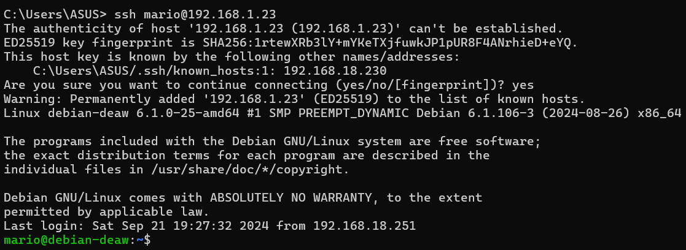
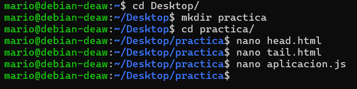
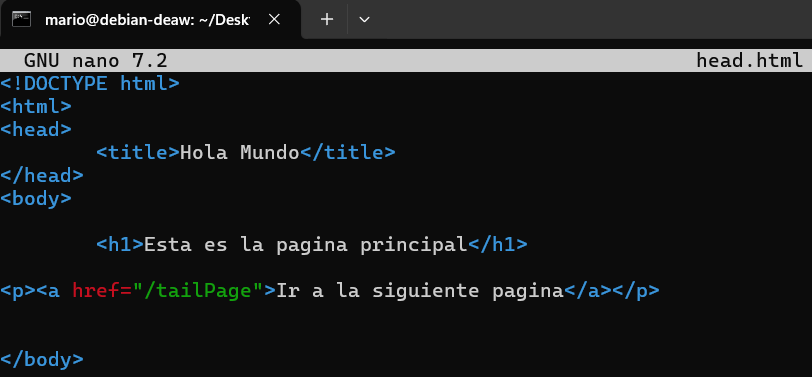
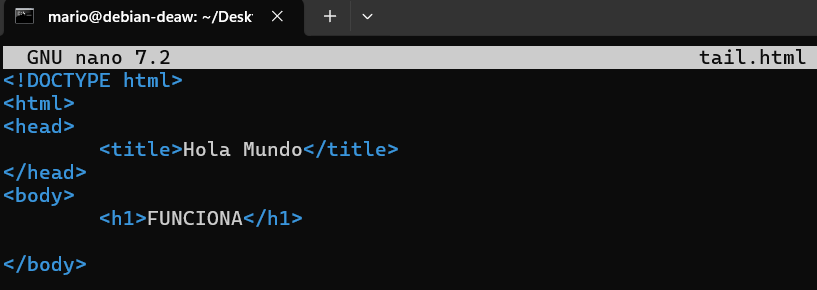
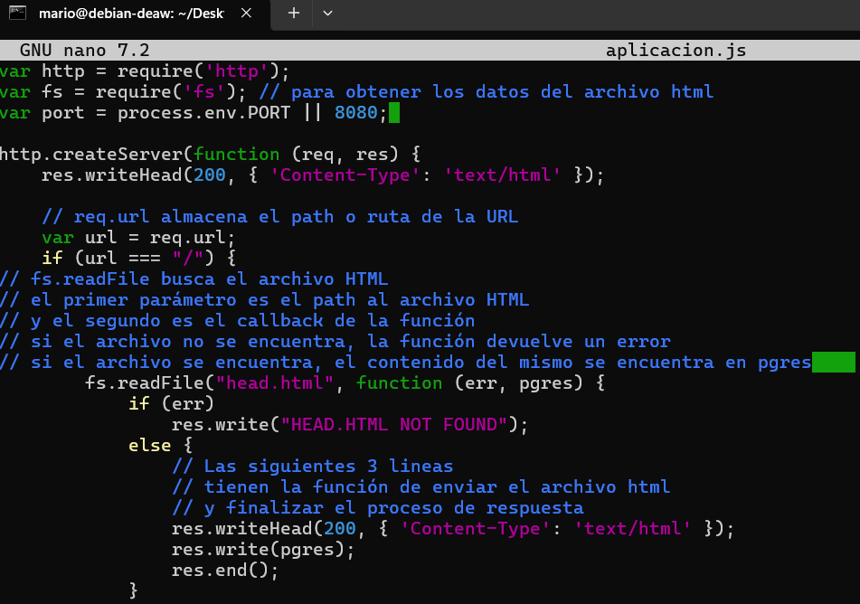

# **Práctica 3.4: Despliegue de una Aplicación React en Netlify (PaaS)**

## Creación de nuestra aplicación

Para realizar la practica nos conectaremos por ssh a nuestra maquina.

Lo primero será crear una carpeta en el escritorio y dentro de esta, tres archivos: `head.html`, `tail.html` y `aplicacion.js`.

El archivo `head.html` contendrá lo siguiente:

El archivo `tail.html` contendrá lo siguiente:

El archivo `aplicacion.js` contendrá lo siguiente:

## Aplicación para Netlify