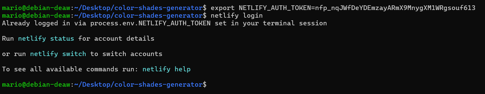

# **Práctica 3.4: Despliegue de una Aplicación React en Netlify (PaaS)**

## Creación de nuestra aplicación

Para realizar la practica nos conectaremos por ssh a nuestra maquina.

Lo primero será crear una carpeta en el escritorio y dentro de esta, tres archivos: `head.html`, `tail.html` y `aplicacion.js`.

El archivo `head.html` contendrá lo siguiente:

El archivo `tail.html` contendrá lo siguiente:

El archivo `aplicacion.js` contendrá lo siguiente:

Para inicializar el proyeto usaremos `npm init` nos pedirá algunos datos a rellenar. 

Despues ejecutaremos la aplicación usando `node aplicacion.js`.

Si accedemos a la dirección `http://localhost:8080/` desde nuestra maquina nos mostrará lo siguiente:

## Aplicación para Netlify

Para desplegar nuestra aplicación en Netlify, vamos a clonar el repositorio para esta practica

## Proceso de Despliegue en Netlify

Se va a desplegar en netlify de dos maneras diferentes.

- Despliegue manual desde el CLI de Netlify, es decir, desde el terminal, a partir de un directorio local de nuestra máquina.

- Despliegue desde un código publicado en uno de nuestros repositorios de Github

### Despliegue Mediante CLI
En este metodo instalaremos el cliente de Netlify dentro de la carpeta de la aplicación.

Para poder loguearnos debemos entrar en netlify, autenticarnos, aceptar la solicitud y crear un token:

una vez ya hecho el siguiente paso será loggearnos en la cuenta de Netlify.

Ahora instalaremos npm en la aplicación y ya podremos desplegar la aplicación en Netlify

El siguiente paso será desplegar netlify, Se creará y configurará un nuevo sitio

Para comprobar que se ha creado correctamente entraremos en la url de la pagina que nos proporciona netlify.

## Despliegue mediante conexión con Github

En primer lugar, vamos a eliminar el site que hemos desplegado antes en Netlify para evitarnos cualquier problema y/o conflicto:

Tambien tendremos que borrar el directorio que clonamos anteriormente con este comando `rm -rf color-shades-generator`. 

nos descargaremos los fuentes en formato .zip

Creamos una carpeta nueva y descomprimimos dentro el zip:

Ahora crearemos un repositorio en github y subiremos los archivos de la practica.

añadiremos el contenido de la carpeta al repositorio.

Una vez hecho esto el repositorio deberia quedar tal que así:

El siguiente paso será enlazar nuestra cuenta de GitHub en Netlify.

despues selecionamos el repositorio de la practica para desplegarlo

Selecionamos en "Deploy"

Y ya tendríamos nuestra pagina desplegada correctamente como se muestra:

Ahora accederemos a la carpeta public y se modificará el archivo robot.txt, pondremos el nombre en disallow, y se subirá al repositorio con su commit.

Como podemos ver se muestra en la web: 

## Despliegue con Vercel

para vercel deberemos seguir los mismos pasos como anteriormente.

Enlazamos github con vercel y desplegamos la practica

Al pinchar en "deploy" nos desplegara el sitio automaticamente como se muestra:

Por último volvemos a modificar robot.txt

Este sería el ultimo paso de la practica correctamente.

