# **Práctica 3.5 - Despliegue de una aplicación Flask**

Para poder realizar esta practica necesitaremos tener previamente estos paquetes instalados: `Nginx`, `Gunicorn` y `Pipenv`.

## Procedimiento completo para el despliegue

El primer paso será Actualizar los repositorios de paquetes del sistema e Instalar Python.

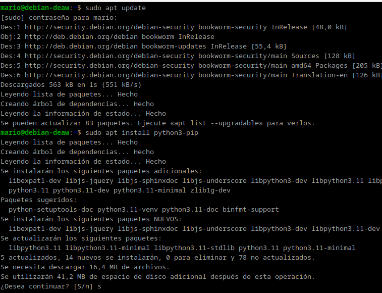

Además instalaremos el paquete pipenv que se encargará de gestionar los entornos virtuales y comprobamos su versión

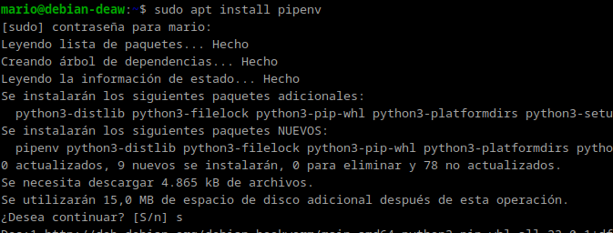

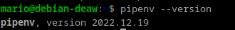

Creamos el directorio en el que almacenaremos nuestro proyecto:

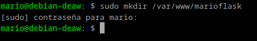

Como lo creamos con `sudo`, los permisos pertenecen al usuario root del sistema:

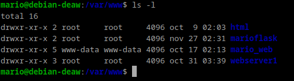

Hay que cambiar los permisos para que pertenezcan a nuestro usuario y pertenezca al grupo www-data.

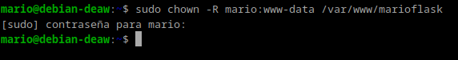

Tendremos que Establecer los permisos adecuados para que pueda ser leído por todo el mundo

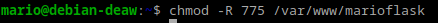

dentro del directorio creado se creará el archivo oculto `.env`

que contendrá las variables de entorno con el comando

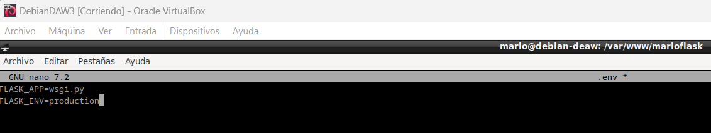

verificamos los cambios con `cat .env`

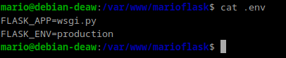

Iniciaremos el entorno virtual y Pipenv cargará las dependencias del archivo .env

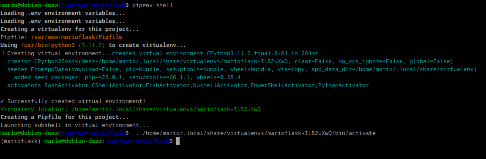

Lo siguiente será instalar las dependencias necesarias para nuestro proyecto

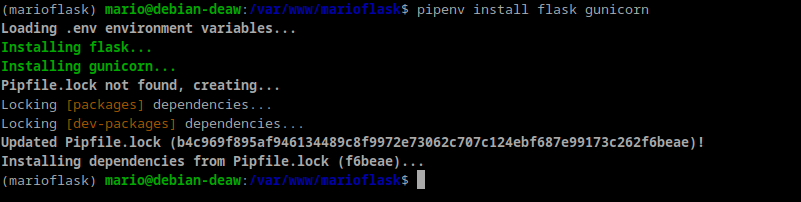

Se crearán los archivos `app.py` y `wsgi.py`  que contendrán lo siguiente:

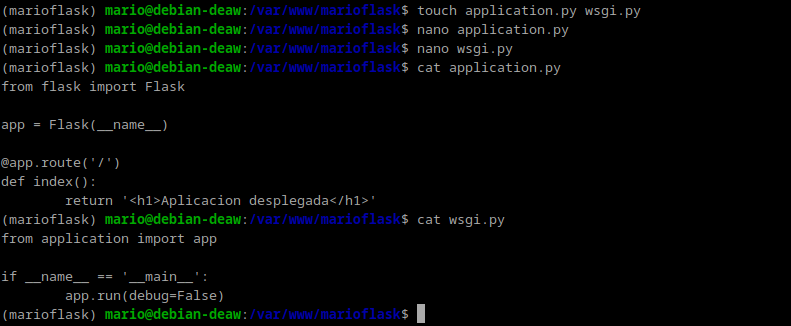

ahora ejecutaremos nuestra aplicación a modo de comprobación con el servidor web integrado de Flask

especificamos la dirección 0.0.0.0 para que escuche en todas sus interfaces.

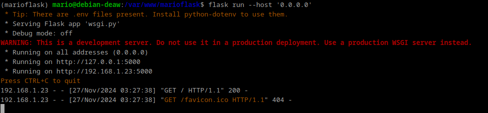

Ahora accedemos desde nuestro navegador a la dirección proporcionada `http://IP-maq-virtual:5000` y nos debería mostrar ver lo siguiente:

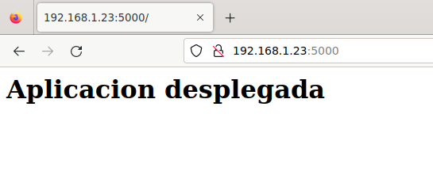

comprobaremos que Gunicorn funciona correctamente:

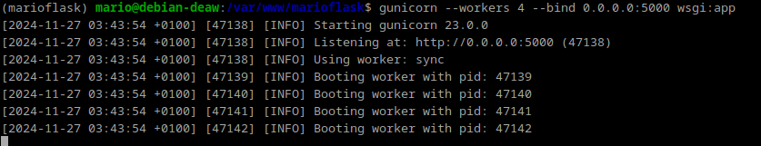

debemos tomar nota de cual es el path o ruta desde la que se ejecuta gunicorn para poder configurar más adelante un servicio del sistema. 

Con el siguiente comando:

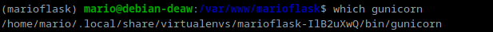

Por último, salimos del entorno virtual con `deactivate`

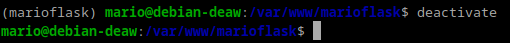

El siguiente paso será Iniciar Nginx y comprobar que su estado sea activo.

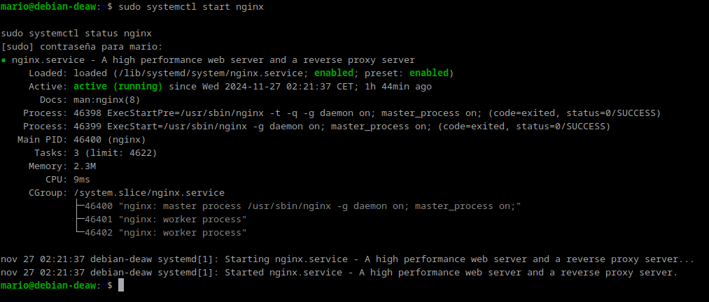

Se creará un archivo de configuración para que systemd ejecute Gunicorn como otro servicio mas:

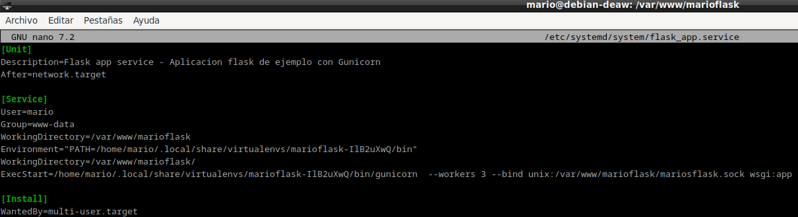

habilitamos el servicio lo iniciamos y comprobamos que está en funcionamiento:

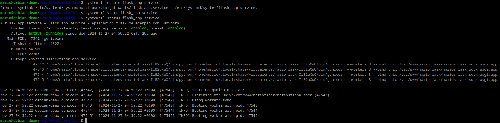

Ahora crearemos un archivo de configuración en Nginx y lo configuraremos de la siguiente manera.

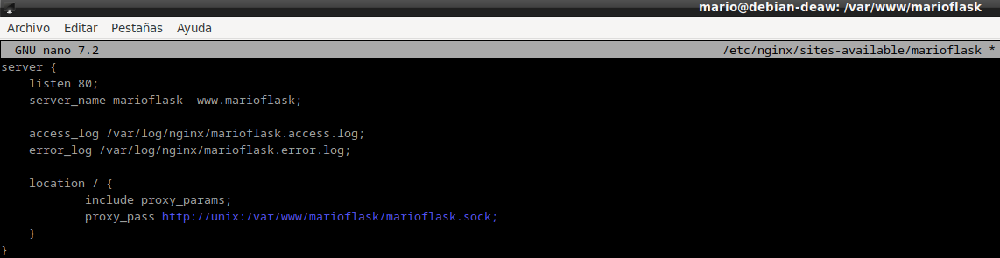

despues crearemos el enlace simbólico para que Nginx pueda acceder a los archivos de la aplicación:

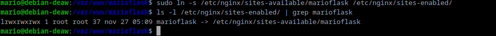

Comprobaremos que la configuración de Nginx es correcta:

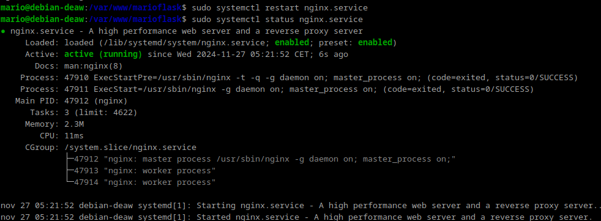

editamos el archivo /etc/hosts de nuestra máquina para que asocie la IP de la máquina virtual:

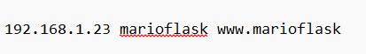

Por ultimo accedemos a nuestro navegador para comprobar que funciona.

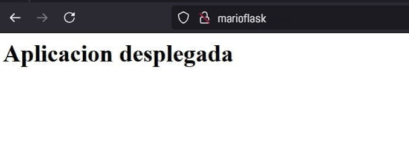

## Ejercicio

Repetimos todo el proceso con la aplicación del siguiente repositorio: https://github.com/raul-profesor/Practica-3.5.

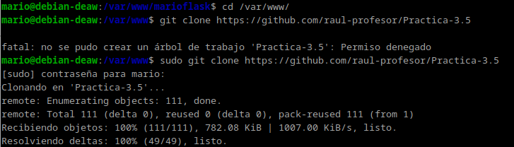

cambiaremos los permisos del directorio y los propietarios:

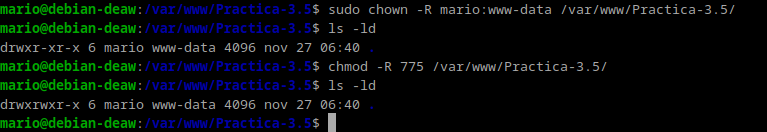

Creamos un archivo oculto `.env `dentro del directorio de nuestra aplicación con `touch .env.`

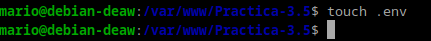

Editamos el archivo como hicimos anteriormente.

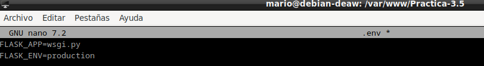

Iniciamos nuestro entorno de la practica.

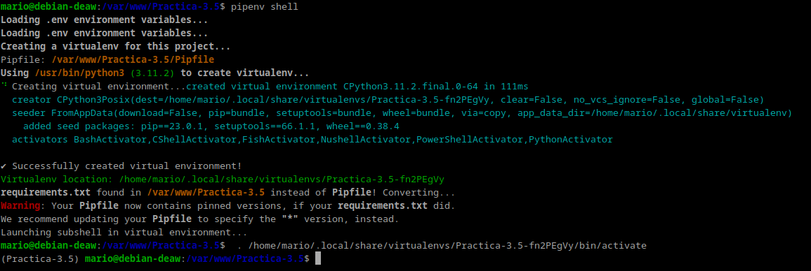

intalamos sus dependencias y gunicorn.

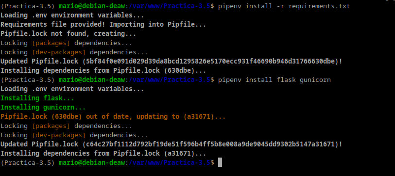

por ultimo creamos el archivo `wsgi.py` y lo editamos.

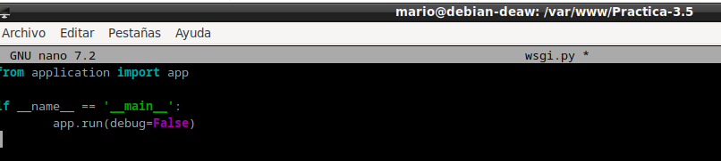

Ejecutaremos la aplicacion y entramos en la ip proporcionada para que nos muestre la pagina en funcionamiento

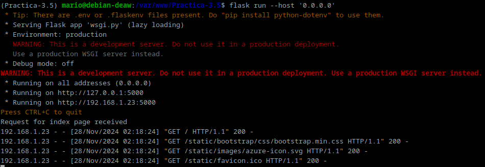

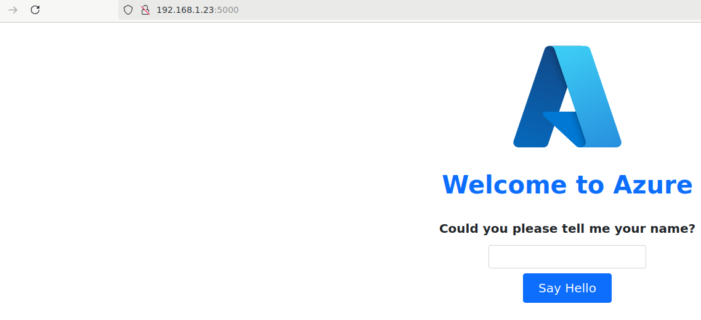

todo correcto.

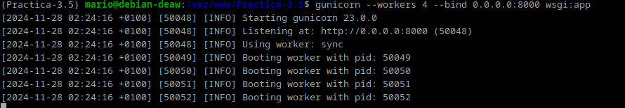

obtendremos el path de Gunicorn para los siguientes pasos y saldremos del entorno virtual.

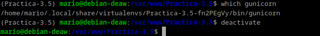

Ahora se desplegarla en Nginx.

Creamos un archivo para que `systemd` corra Gunicorn

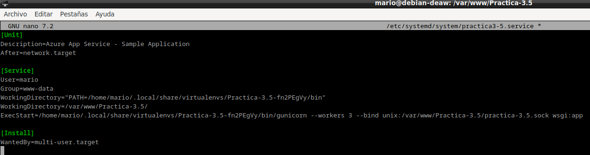

tendremos que configurar el sitio web de Nginx

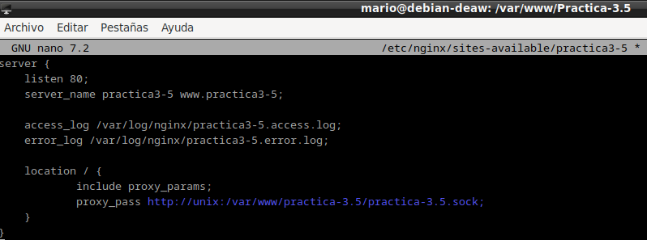

Se habilitará el servicio y se hará el enlace simbólico:

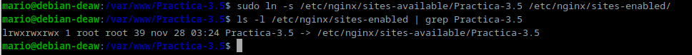

Tendremos que comprobar que el servicio está correcto y funciona correctamente

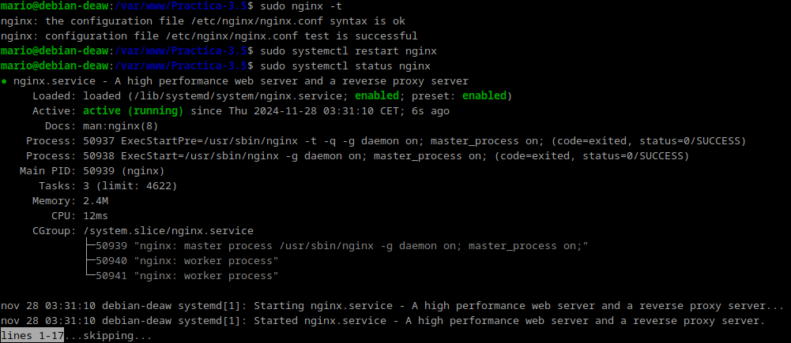

Por último tendremos que editar el archivo /etc/hosts y añadir la IP nuestra máquina a nuestro server_name.

comprobamos que la aplicación final funciona: 

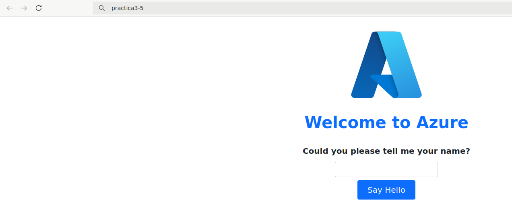

## Cuestion

Un servidor WSGI (Web Server Gateway Interface) es un intermediario entre un servidor web (como Nginx o Apache) y una aplicación Python (como Flask o Django). Su función principal es traducir las solicitudes del servidor web a un formato que la aplicación Python pueda entender y, luego, devolver la respuesta generada por la aplicación al servidor web.

*¿Por qué lo necesitamos?*
Los servidores web están diseñados para manejar conexiones y archivos estáticos, pero no pueden ejecutar directamente el código Python de una aplicación. El servidor WSGI facilita esa comunicación y permite que las aplicaciones Python funcionen correctamente en un entorno de producción.

*Ejemplo:*
Cuando un usuario visita tu sitio web, el servidor web (Nginx) pasa la solicitud al servidor WSGI (como Gunicorn), que ejecuta la aplicación Python (como Flask), y luego le devuelve al servidor web la respuesta que será enviada al navegador.

En resumen, un servidor WSGI actúa como puente entre el servidor web y la aplicación Python, permitiendo que trabajen juntos para manejar solicitudes web.

