# **Práctica 6.1 - Dockerización del despliegue de una aplicación Node.js**

## Despliegue con Docker

primero debemos clonar el siguiente repositorio de GitHub y entramos en el directorio del proyecto con:

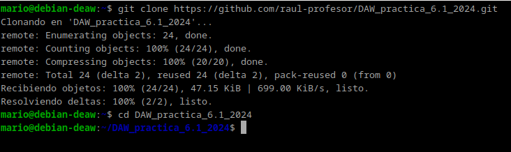

Instalamos docker con el siguiente comando para poder seguir con la practica:

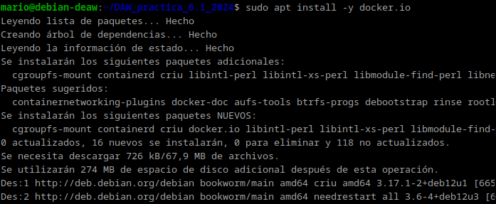

Dentro del directorio del proyecto, creamos y editamos un archivo llamado Dockerfile para definir la imagen que se va a construir. El contenido que puse fue el siguiente:

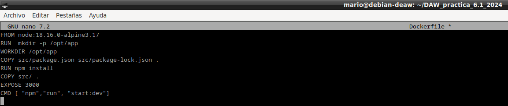
Con el Dockerfile listo, construímos la imagen ejecutando:
docker build -t librodirecciones .

Este comando construye la imagen Docker utilizando el Dockerfile y le asigna el nombre librodirecciones. El punto (.) indica que el contexto de construcción es el directorio actual.

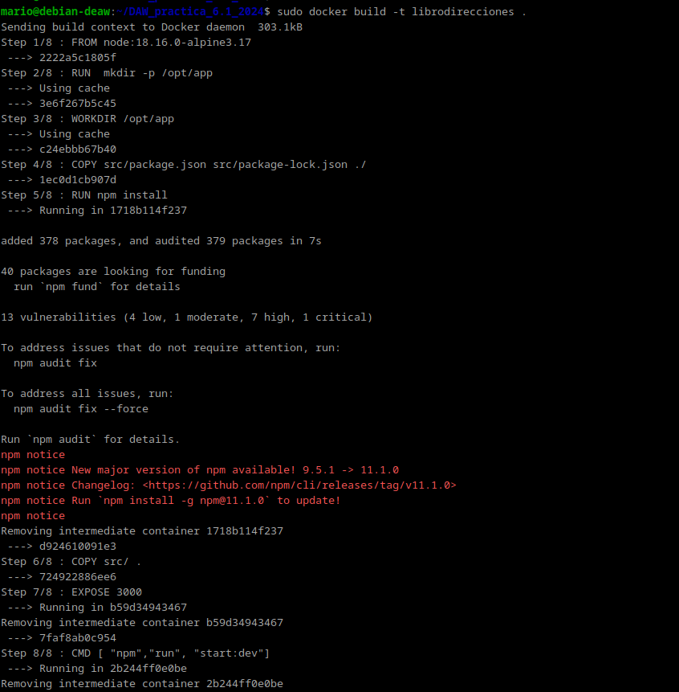

Para ver si la imagen funcionaba, lancé un contenedor con el siguiente comando

mapeo el puerto 3000 del contenedor al puerto 3000 de mi máquina, lo que me permite acceder a la app a través de ese puerto.

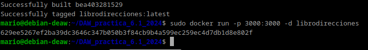

Al hacer esto, me di cuenta de que la aplicación intentaba conectar con la base de datos en localhost, pero como cada contenedor tiene su propia red, la app no podía encontrar la base de datos. Esto me llevó a configurar Docker Compose.

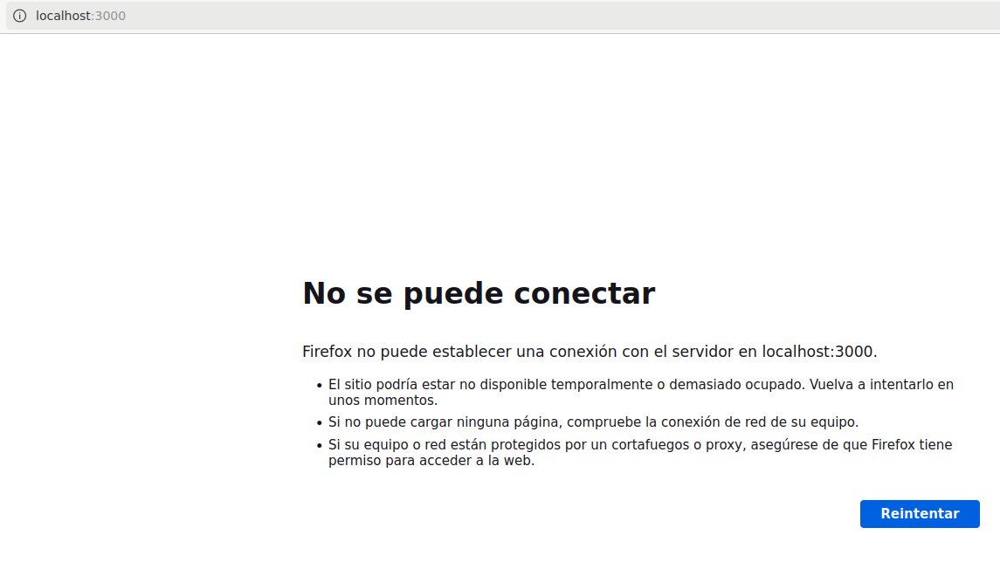

## Docker Compose

Debemos tener instalado el docker compose como se muestra

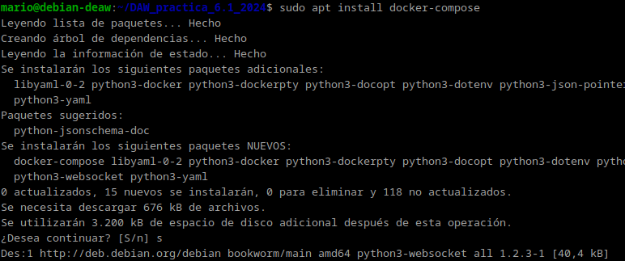

Ahora crearemos un archivo llamado docker-compose.yml en la raíz del proyecto con el siguiente contenido:

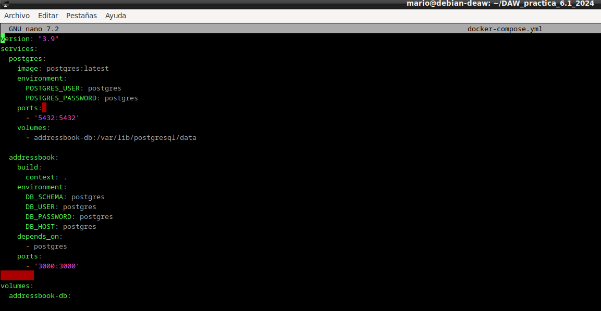

*Servicio postgres:* Configura una base de datos PostgreSQL. Se establecen las variables de entorno necesarias, se expone el puerto 5432 y se utiliza un volumen para mantener los datos.

*Servicio addressbook:* Construye la imagen de la aplicación a partir del Dockerfile. Las variables de entorno (DB_HOST: postgres, etc.) permiten que la app se conecte a la base de datos que se levanta en el contenedor postgres.

*depends_on:* Asegura que el contenedor de PostgreSQL se inicie antes que la aplicación.

Antes de levantar todos los servicios, necesitamos crear las tablas en la base de datos.

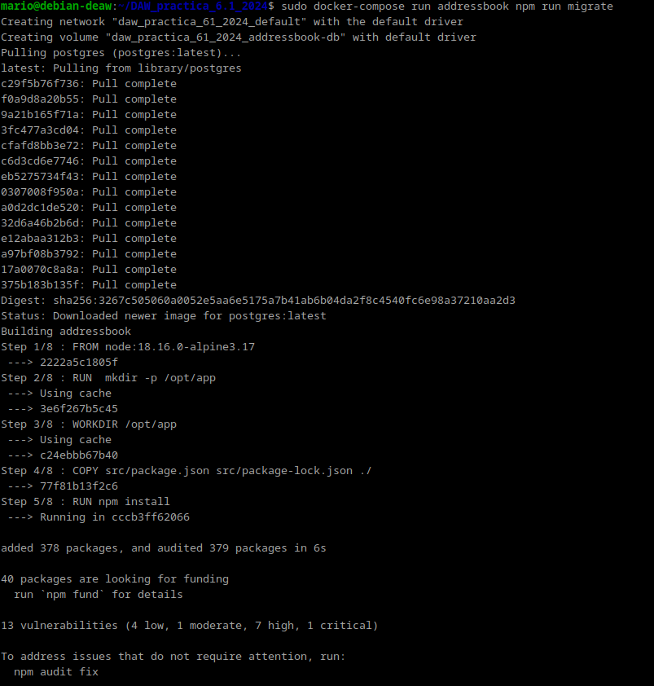

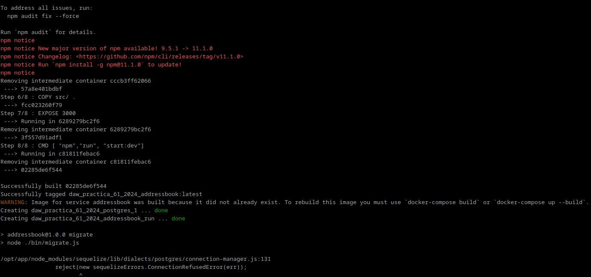

Este comando inicia un contenedor temporal del servicio addressbook para ejecutar el script de migración que crea las tablas necesarias en PostgreSQL.

Después de migrar la base de datos, levantamos todos los contenedores con:

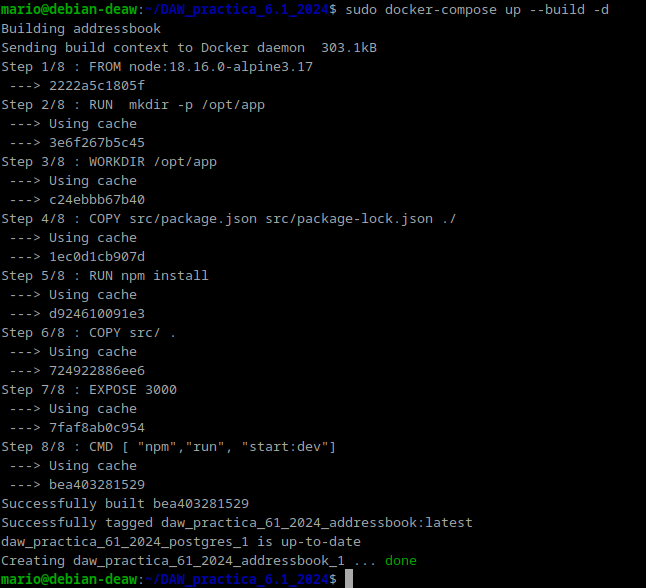

podemos verlo con el siguiente comando

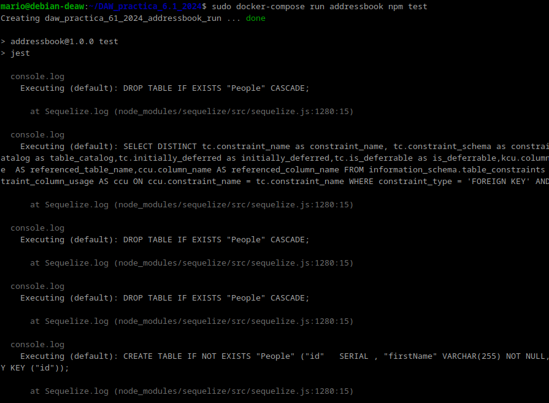

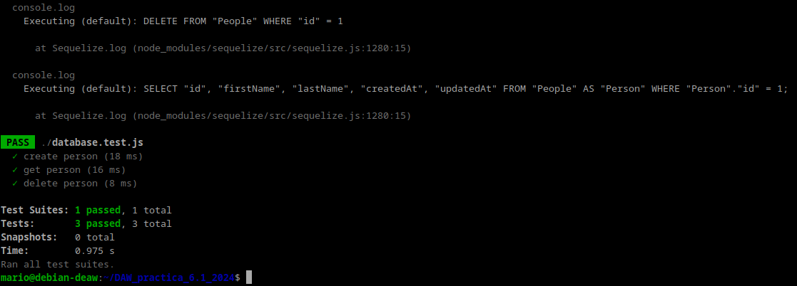

Utilizamos curl para probar que la API funcionara correctamente

*Añade una persona:* curl -X PUT http://localhost:3000/persons -H 'Content-Type: application/json' -d '{"id": 1, "firstName": "Raúl", "lastName": "Profesor"}'

*Listar todas las personas:* curl -X GET http://localhost:3000/persons/all -H 'Content-Type: application/json'

*Buscar una persona por ID:* curl -X GET http://localhost:3000/persons/1 -H 'Content-Type: application/json'

*Eliminar una persona:* curl -X DELETE http://localhost:3000/persons/1 -H 'Content-Type: application/json'

