# **Práctica 6.2 - Despliegue de una aplicación PHP con Nginx y MySQL usando Docker y Docker-Compose**

## Proceso de dockerización de Nginx+PHP+MySQL

primeronos nos conectamos por ssh nuestra maquina virtual

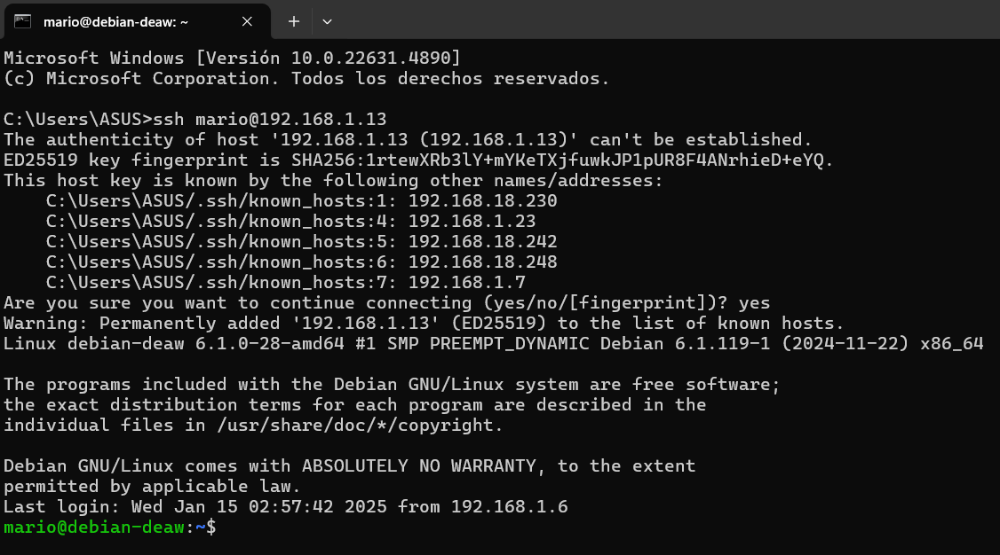

### 1.Estructura de Directorios

Creamos una estructura de directorios como la siguiente:

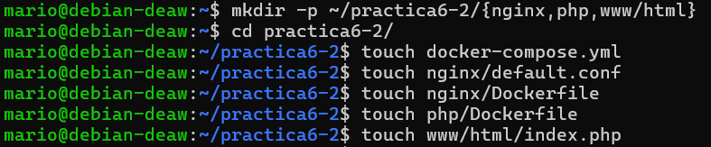

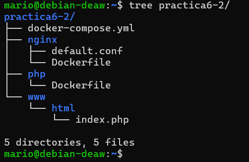

### 2.Creación de un Contenedor Nginx

El siguiente paso será crear un contenedor Nginx para alojar la aplicacion PHP

tendremos que editar el archivo "docker-compose.yml"

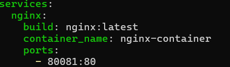

Iniciamos el contenedor de Nginx y comprobamos que todo funciona como debe.

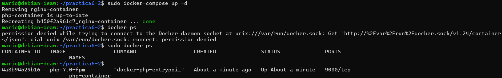

Descargará la última versión de la imagen de Nginx, creará un contenedor  y mapeará el puerto 80 del contenedor al puerto 8081 del host.

Si accedemos a la dirección localhost y su puerto 8081 mostrará lo siguiente:

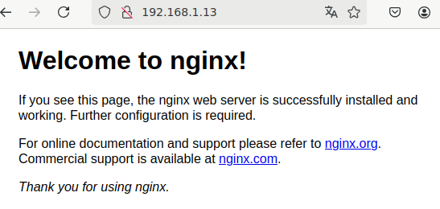

### 3.Creación de un Contenedor PHP

Tendremos que Editar el archivo index.php de la siguiente manera:

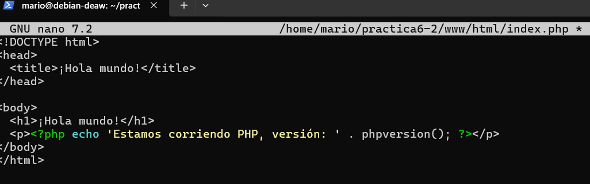

el siguiente paso será crear el archivo de configuración default.conf en la carpeta nginx como en lo siguiente:

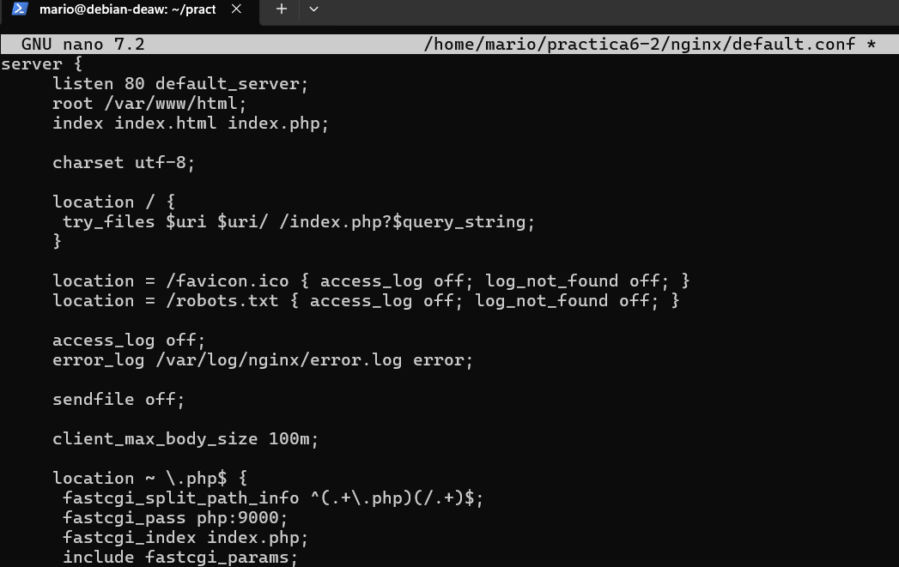

también se deberá modificar el archivo Dockerfile dentro del directorio nginx.

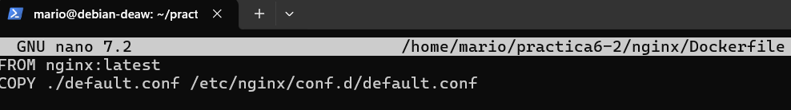

despues modificamos el archivo docker-compose.yml ( he modificado el puerto porque el 8081 me daba problemas )

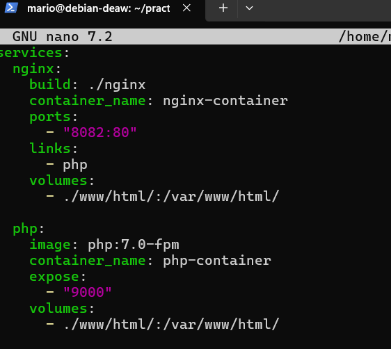

Ahora levantamos los contenedores y comprobamos que todo se queda funcionando

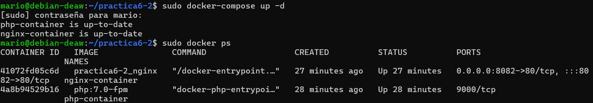


Si accedemos a la dirección http://localhost:8082 deberá mostrar que funciona:

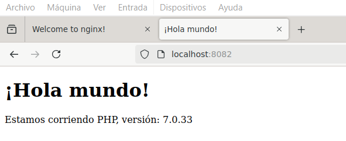

### 4.Creación de un Contenedor para Datos

En este apartado se debe crear un contenedor para almacenar datos, deberemos hacerlo modificando el archivo "docker-compose.yml" como se indica:

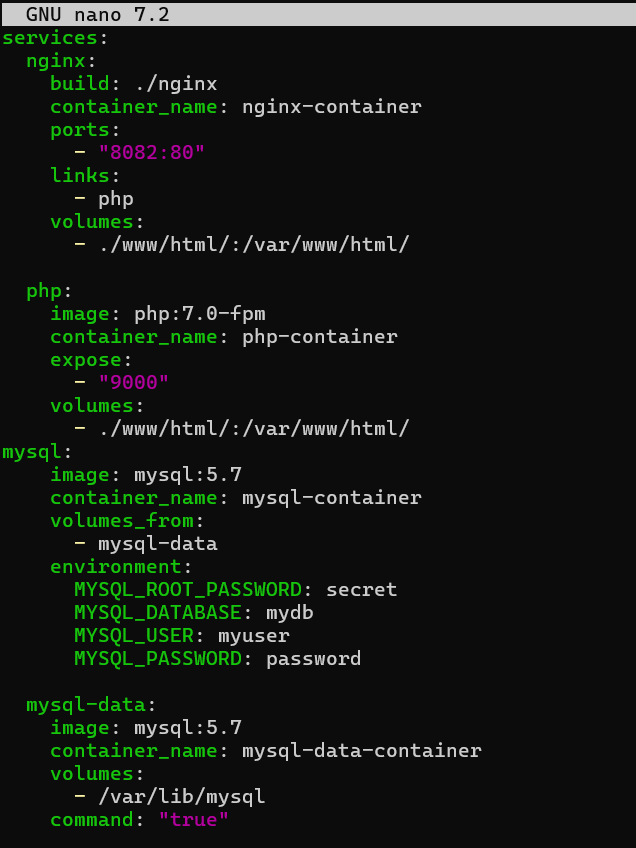

Comprobamos que funciona

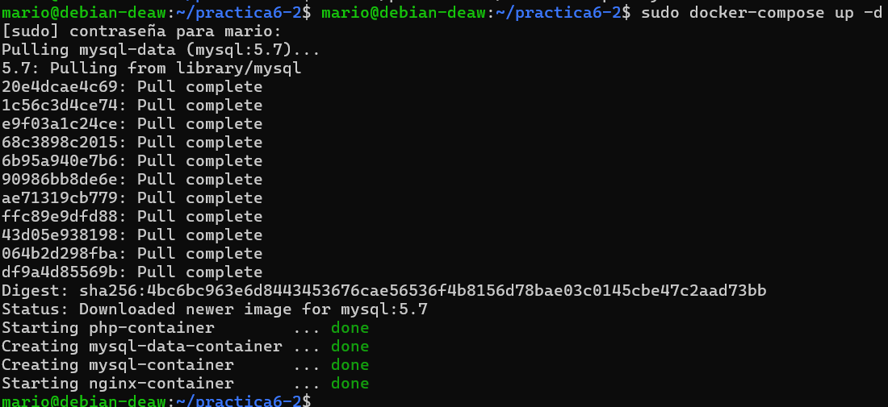

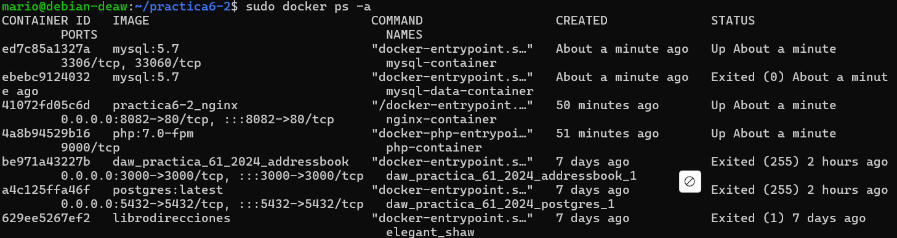

### 5.Creación de un Contenedor MySQL

Lo siguiente será crear el contenedor MySQL para alojar la base de datos de la aplicación PHP.

Primero modificamos el archivo dockerfile del directorio php:

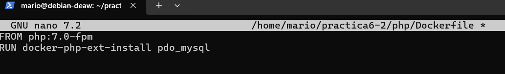

Despues modificamos el archivo docker-compose.yml añadiendo lo siguiente:

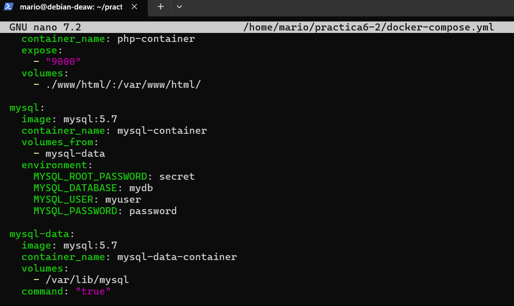

Tendremos que modificar el archivo index.php de la siguiente manera:

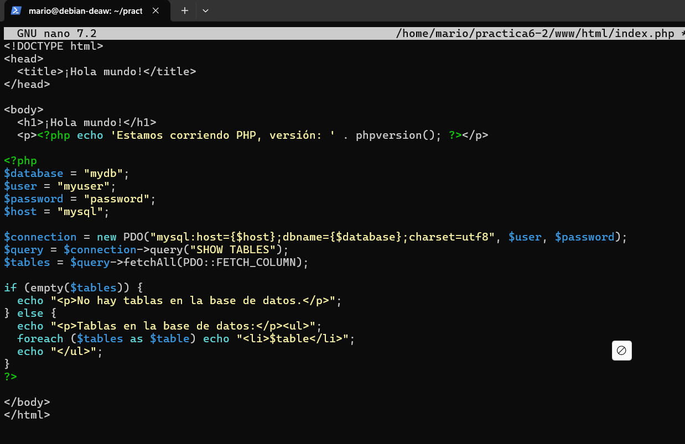

Ahora comprobaremos que el contenedore de MYSQL funiona correctamente

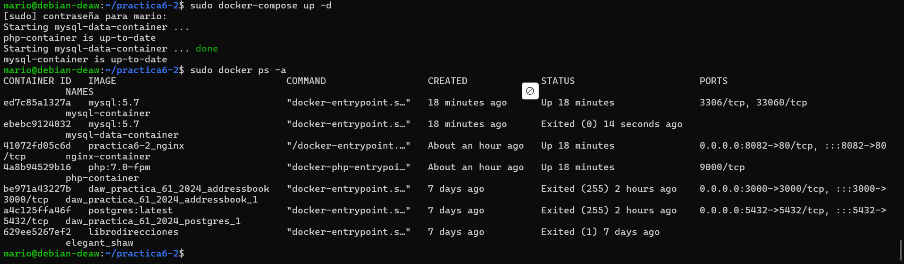

### 6.Verificación de Conexión a la Base de Datos

Si ahora accedemos a http://localhost:8082, deberíamos obtener la siguiente pantalla:

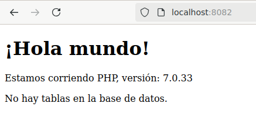

Pero si se modificamos el archivo `index.php` con el siguiente contenido:

```php	
    $user = 'root';
    $password = 'secret';
```

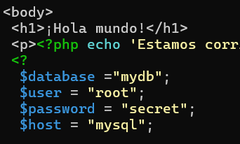

Si se accede a la dirección http://localhost:8082 (Yo lo he hecho en el puerto 8082) deberá aparecer lo siguiente:

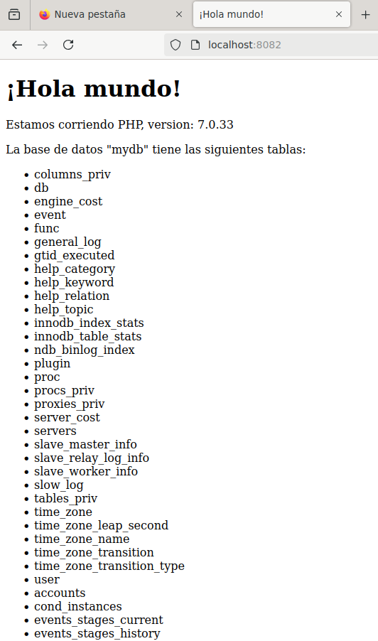

Esto significa que todo el proceso se ha realizado correctamente.

### 7.Esquema de la Aplicación

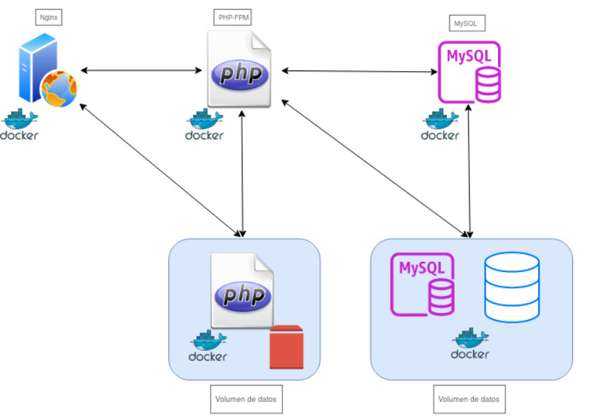 

