# **Práctica 6.3 - Despliegue de servidores web con usuarios autenticados mediante LDAP usando Docker y docker-compose**

## Despliegue con Docker de NGINX + demonio de autenticación LDAP + OpenLDAP

Nos conecataremos a nuestra maquina mediante ssh para realizar la Práctica

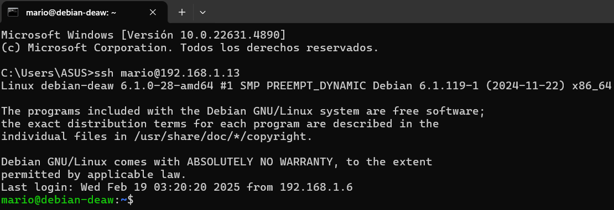
 
Con los siguientes comandos crearemos la siguiente estructura de directorios.

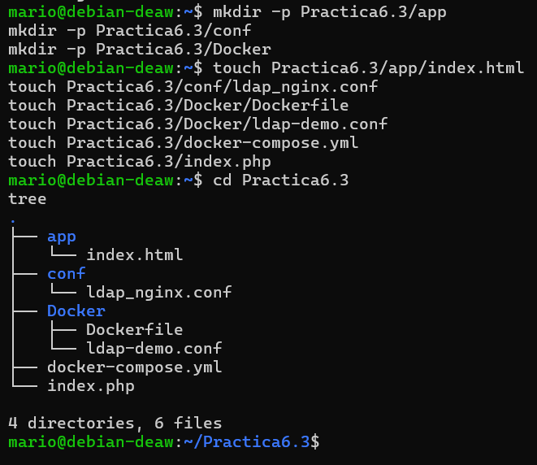

Una vez tenemos la estructura hecha, dentro del directorio app crearemos un archivo index.html

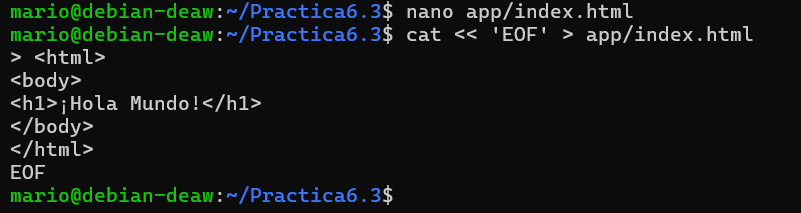

Despues creamos el directorio "conf" y dentro el archivo "ldap_nginx.conf" con su contenido:

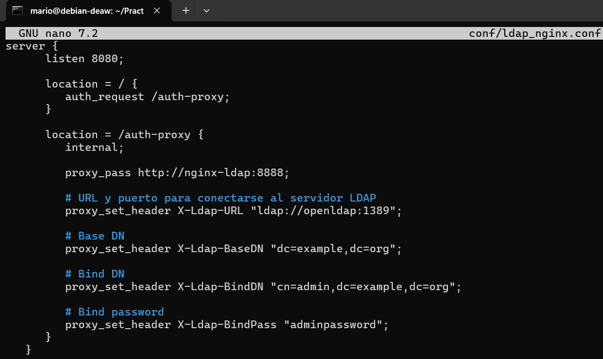

Con esta configuración le decimos a NGINX que:

-Escuche en el puerto 8080.

-Redirija todas las peticiones a la ubicación / hacia /auth-proxy, donde se realiza la autenticación.

-En /auth-proxy se hace proxy al contenedor nginx-ldap (en el puerto 8888) y se configuran las cabeceras para conectarse al servidor LDAP.

Ahora crearemos el archivo docker-compose.yml con su ontenido correspondiente:

Se definen tres servicios:

-nginx-ldap: Ejecuta el demonio de autenticación LDAP (escucha en el puerto 8888).

-nginx: Servidor web que carga el contenido de app y la configuración desde conf/ldap_nginx.conf, exponiendo el puerto 8080.

-openldap: Servidor LDAP configurado con las credenciales indicadas, escuchando en el puerto 1389.

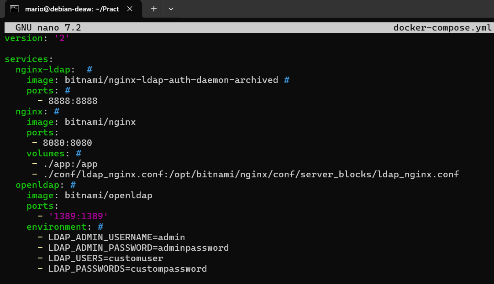

Con el siguiente comando levanta los tres servicios definidos.

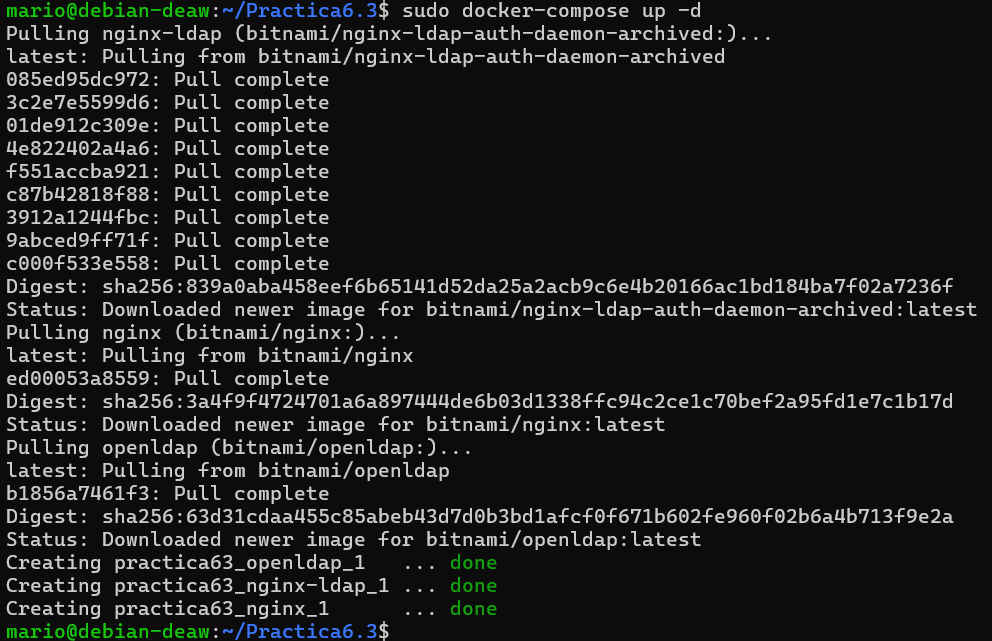

Una vez en ejecución, podemos acceder a la aplicación en:
"http://IP_Maq_Virtual:8080"

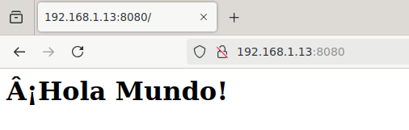

Podemos ver que funciona.

## Despliegue con Docker de PHP + Apache con autenticación LDAP

Dentro de un directorio llamado Practica6.3, creamos el archivo index.php con el siguiente contenido:

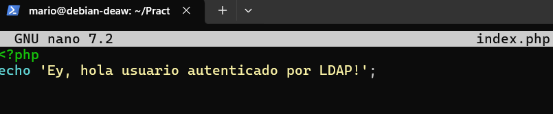

Luego, creamos un directorio llamado Docker donde ubicaremos el Dockerfile y los archivos de configuración adicionales.

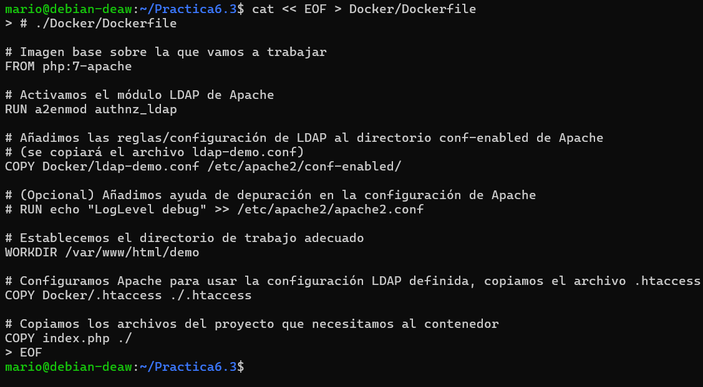

Despues creamos el archivo "ldap-demo.conf" en el directorio "Practica6.3/Docker" con el siguiente contenido:

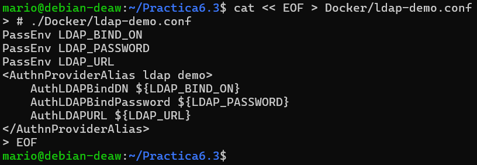

Creamos el archivo .htaccess en el directorio Practica6.3/Docker:

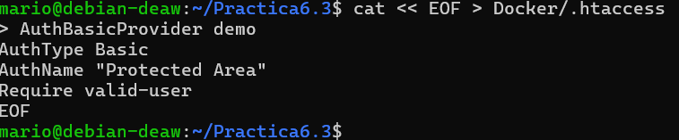

Este archivo configura la autenticación básica para la zona protegida (en este caso, la carpeta demo).

Desde el directorio Practica6.3 (donde se encuentra index.php y la carpeta Docker), ejecutamos:

Para construir una imagen llamada "docker-ldap" usando el Dockerfile ubicado en "./Docker/Dockerfile."

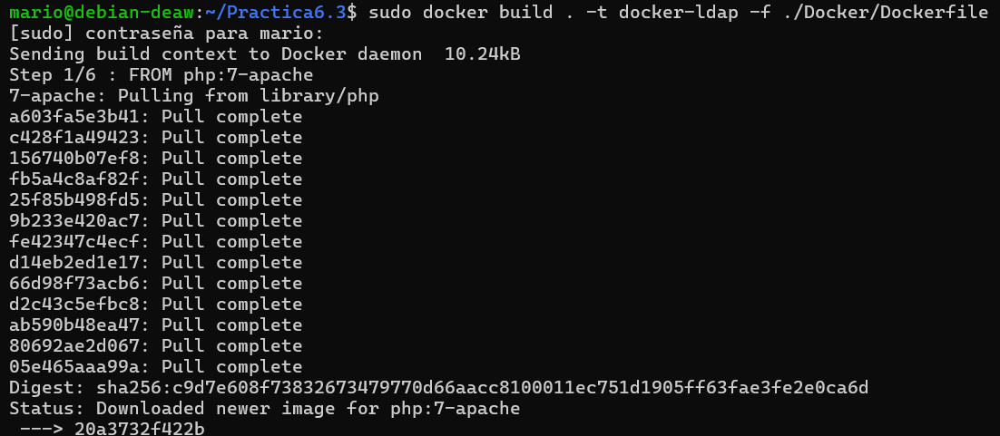

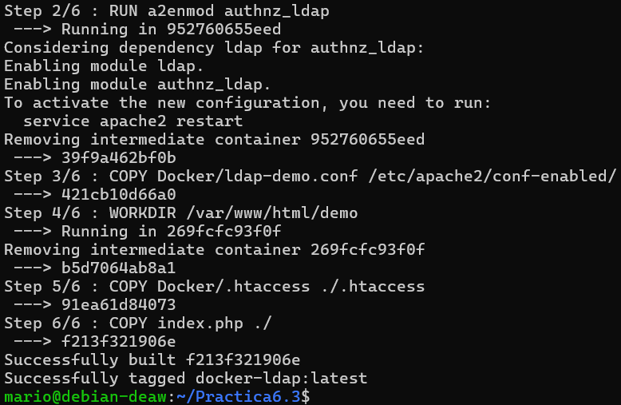

Si todo funciona ejecutaremos el siguiente comando para levantar el contenedor:

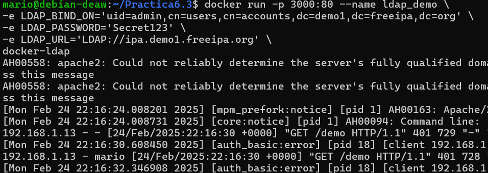

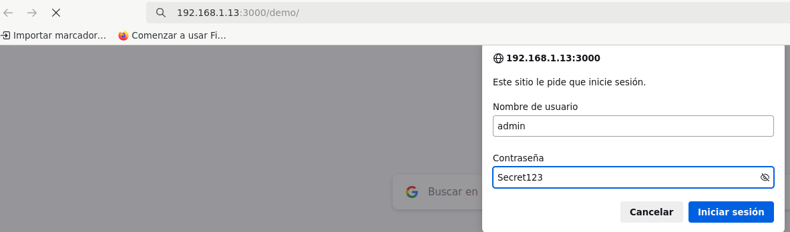

Accedemermos a la dirección http://tu-ip:3000/demo introducimos con las credenciales de acceso admin y Secret123.

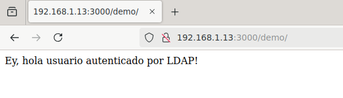

Se nos ha salido la imagen final esta correcto

