# **Configuración de un Servidor Nginx con Hosts Virtuales y Directorios de Usuario**

## Conexión SSH

El pirmer paso será conectar nuestra maquina física con nuestra maquina virtual mediante ssh.

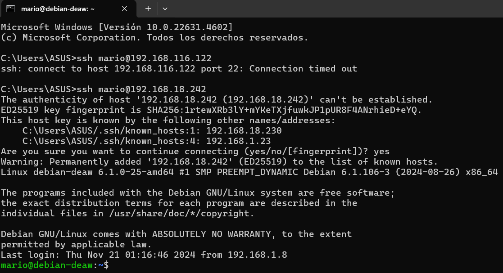

## Creacion de Usuarios

En este paso, creamos los usuarios necesarios utilizando el comando useradd. Es importante asignarles contraseñas seguras para garantizar la seguridad del sistema. Adicionalmente, se configuran sus directorios personales de manera automática al crearlos.

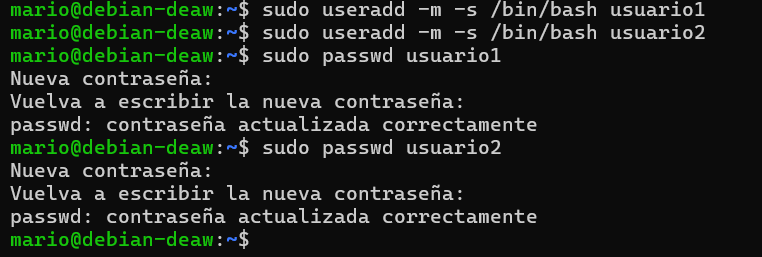

## Creación de las Carpetas

Una vez creados los usuarios, accedemos con cada uno de ellos mediante el comando su. En sus directorios personales, creamos la carpeta public_html utilizando mkdir. Esta carpeta será el lugar donde cada usuario almacenará los archivos de su página web.

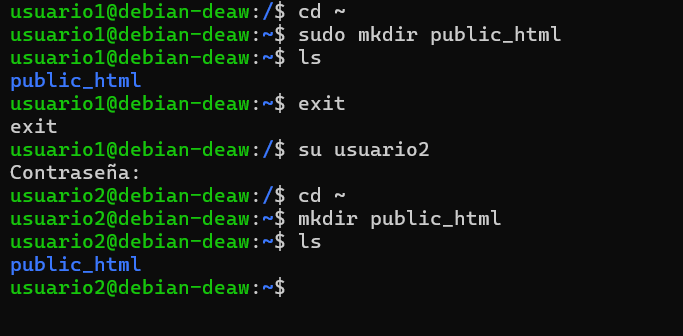

## Asignar Permisos

Es esencial ajustar los permisos de las carpetas public_html para que Nginx pueda acceder al contenido sin comprometer los privilegios de los usuarios. Configuramos los permisos para que el servidor pueda leer y servir los archivos web correctamente, pero manteniendo la propiedad de los archivos en manos de cada usuario.

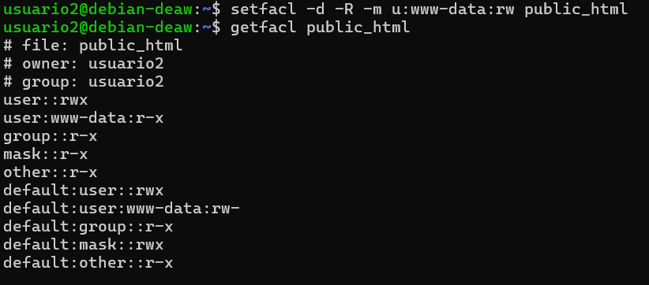

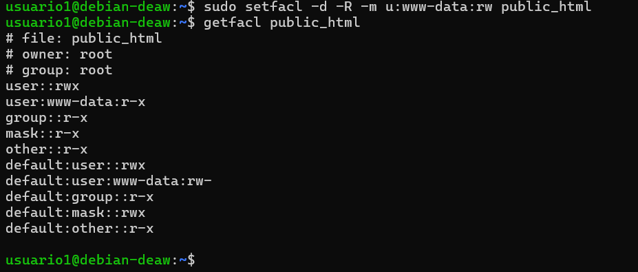

## Páginas Web Correspondientes

Para comprobar que todo funciona crearemos dos archivos index.html para cada usuario en las carpetas public_html.

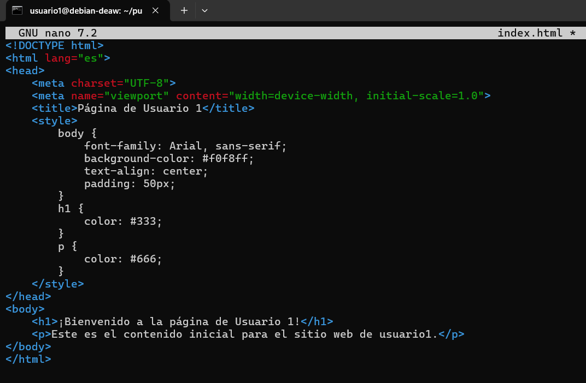

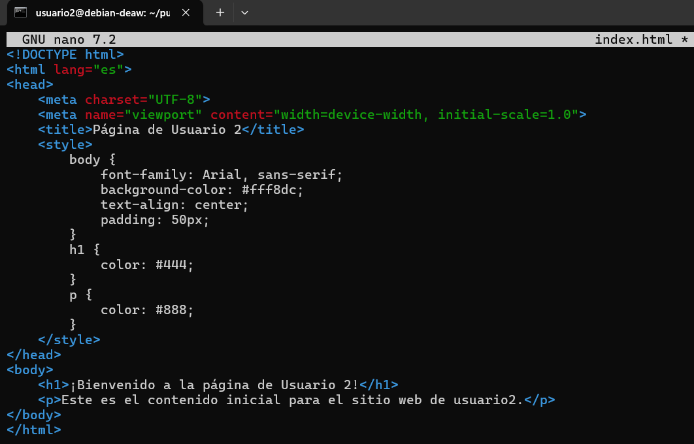

## Configuración de Nginx

Instalaremos nginx y comprobaremos que su funcionamiento es correcto con el siguiente comando.

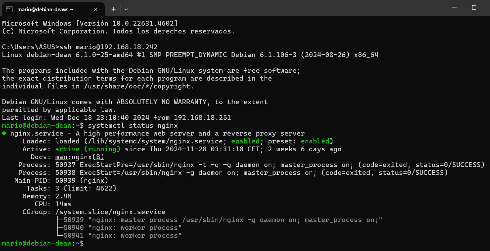

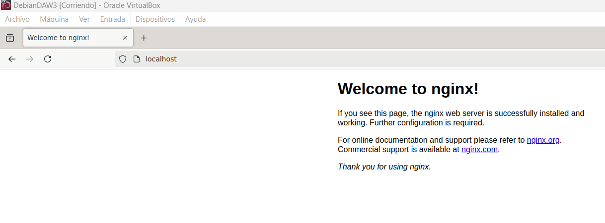

hasta aquí bien es siguiente pasó será generar los certificados SSL con el siguiente comando

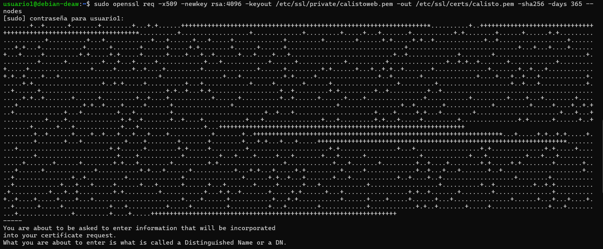

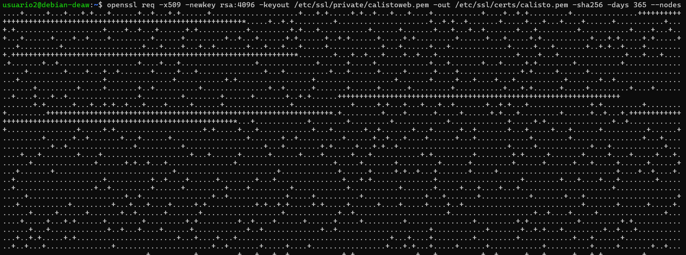

## Configuración Hosts Virtuales

Ahora tendremos que configurar los host virtuales pero antes debemos crear el archivo en la carpeta `/etc/nginx/sites-available` en cada usuario correspondiente.

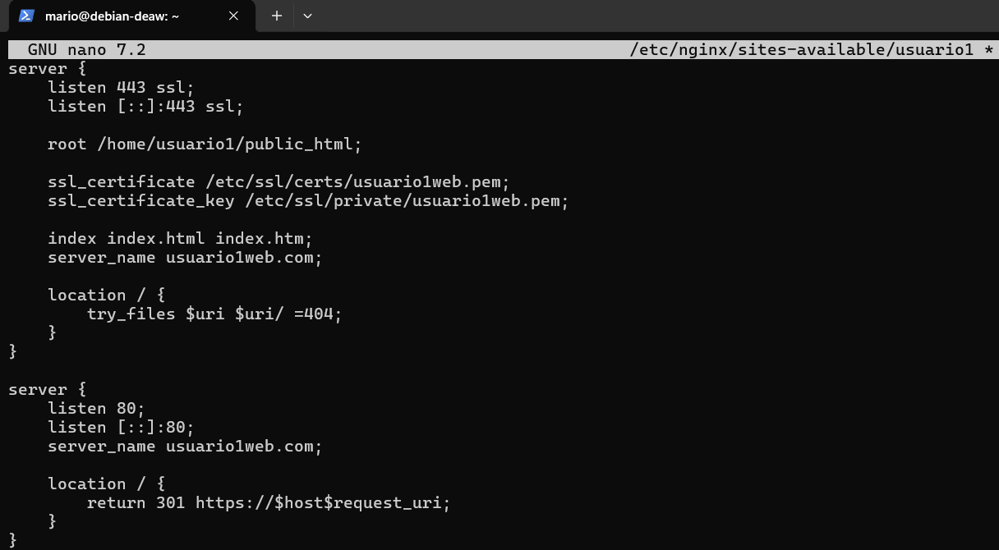

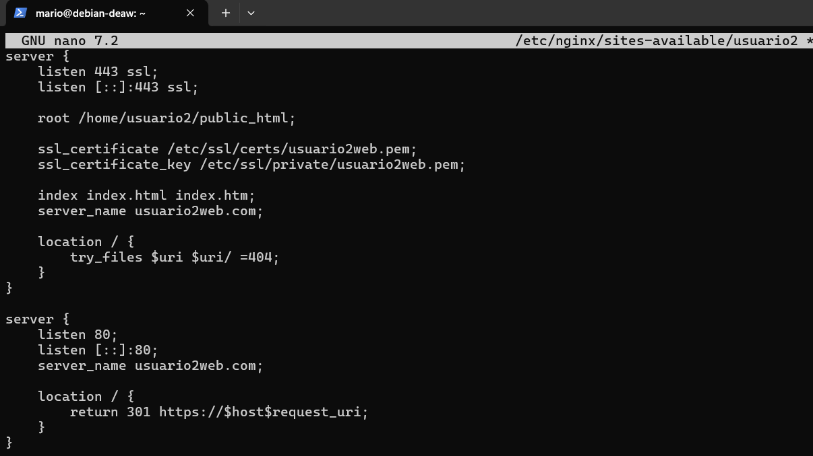

Una vez que escribímos el archivo de configuración en sites-available, no basta con que esté ahí; también hay que activarlo. Para hacerlo, en vez de copiar el archivo a /etc/nginx/sites-enabled/ (donde Nginx lee los sitios activos), crearemos un enlace simbólico para cada uno. Esto permite gestionar los sitios fácilmente, ya que podemos activarlos o desactivarlos sin mover ni duplicar archivos.

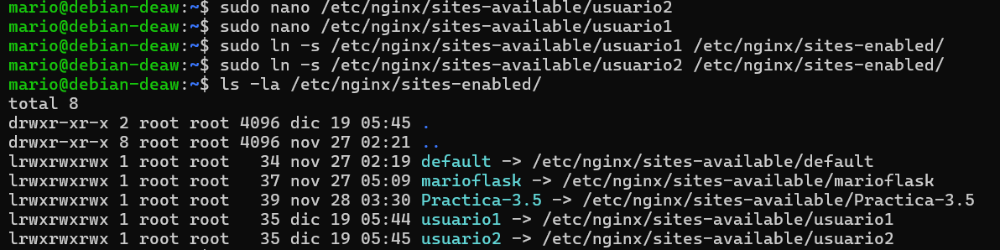
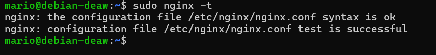

## Hosts Virtuales

El archivo hosts en C:\Windows\System32\drivers\etc\hosts permitiremos asociar manualmente direcciones IP con nombres de dominio en nuestra máquina. Para comprobar y configurar los hosts virtuales que hemos creado, debemos añadir una línea para cada host virtual que apunte a la dirección IP correspondiente.

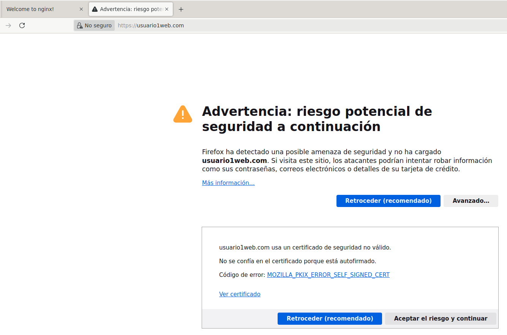

No mostrará una advertencia, deberemos pulsar en "aceptar el riesgo y continuar"

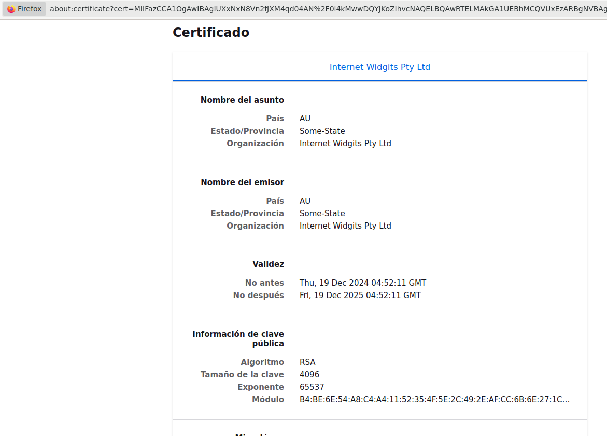

Podremos pinchar en "ver certificado" para ver que su creación ha sido exitosa y correcta.

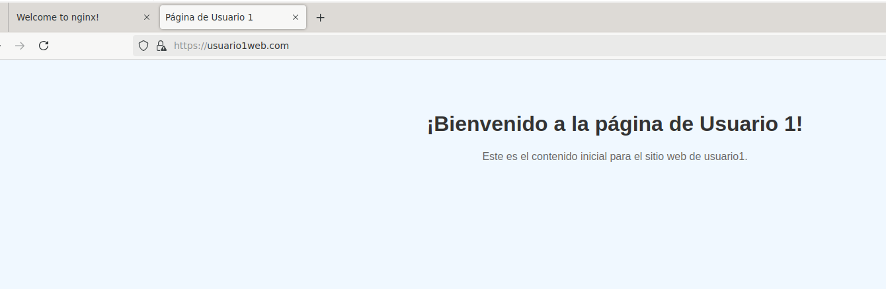
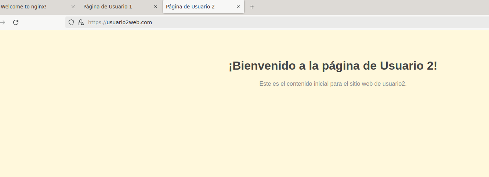

Finalente nos mostrará las 2 páginas de cada uno que hemos creado.